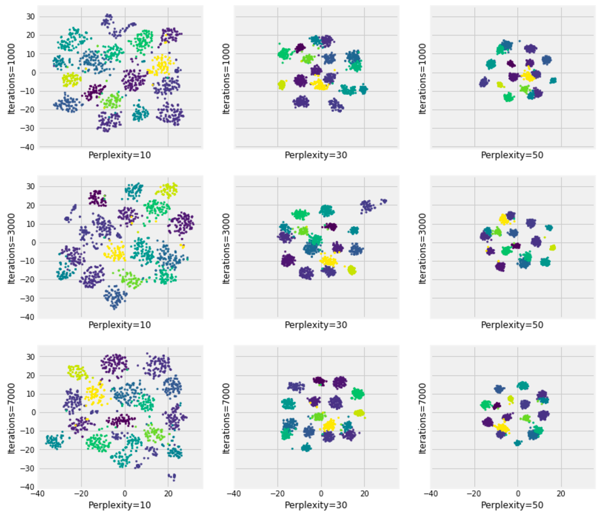

# Фаза 1 • Неделя 3 • Понедельник

## Кластеризация и понижение размерности
## Clustering & dimensionality reduction

--- 
<!--- backgroundColor: white --->
<!--- paginate: true --->
<!--- header: "" --->

# Задача обучения без учителя

### Цель
> группировать объекты схожей природы по группам (кластерам) так, чтобы объекты в каждом кластере обладали схожими свойствами, т.е. находились близко друг к другу в каком-либо пространстве

 
 

На входе: 
- признаковое описание объектов $X$
- матрица расстояний между объектами

---
<!-- _footer: 📊 [Демо  1](http://alekseynp.com/viz/k-means.html) 📊[Демо 2](https://www.naftaliharris.com/blog/visualizing-dbscan-clustering/)-->

# Метод K-средних / K-means
### Алгоритм

1. **Инициализация центроидов**: Инициализируем центроиды кластеров случайным образом или выбираем из наблюдений.

2. **Назначение кластеров**: Для каждой точки данных определяем ближайший кластер по расстоянию до центроидов.

3. **Перемещение центроидов**: Пересчитываем центроиды кластеров, используя средние значения точек данных в каждом кластере.

4. **Повторение шагов 2 и 3**: Повторяем назначение кластеров и перемещение центроидов до сходимости алгоритма.

* **`Смотрим демо:`**  [визуализация Kmeans](http://alekseynp.com/viz/k-means.html)

---
# Иерархические методы

Делят выборку не на фиксированное число кластеров, а строят вложенные (иерархические) разбиения. 

Алгоритм при _аггломеративном_ подходе: 
1. Каждый объект считаем отдельным кластером
2. Для каждого объекта находим ближайший, объединяем в новые кластеры
3. Повторяем до тех пор, пока не останется один кластер, содержащий все объекты выборки

_Дивизимный_ подход противоположен: сначала все объекты находятся в одном кластере, далее кластер дробится до тех пор, пока число кластеров не станет равно объему выборки.

---
<!-- _footer: https://scikit-learn.org/stable/modules/generated/sklearn.cluster.AgglomerativeClustering.html -->

# Agglomerative vs. Divisive

<!-- ---
# Иерархические методы 
 

 -->

--- 
<!-- _footer: 📊[Plot Hierarchical Clustering Dendrogram](https://scikit-learn.org/stable/auto_examples/cluster/plot_agglomerative_dendrogram.html#sphx-glr-auto-examples-cluster-plot-agglomerative-dendrogram-py) -->
# Дендрограмма 

---
# Плотностной подход / Density based

> Если объекты расположены близко друг другу и имеют определенное число соседей, то они принадлежат к одному кластеру

  

- [`sklearn.cluster.DBSCAN`](https://scikit-learn.org/stable/modules/generated/sklearn.cluster.DBSCAN.html)
  - Density-Based Spatial Clustering of Applications with Noise
- [sNN](http://mlwiki.org/index.php/SNN_Clustering#SSN_Clustering_Algorithm)
  - Shared  Nearest  Neighbor

---
<!-- _footer: 📊[Демо](https://www.naftaliharris.com/blog/visualizing-dbscan-clustering/)-->

# DBSCAN 

--- 
<!-- _footer: https://scikit-learn.org/stable/modules/clustering.html -->

---
# Метрики кластеризации

- Внешние / External –  меры качества, использующие известное распределение по классам
- Внутренние / Internal – меры качества, оценивающие только признаковую информацию об объектах

---
# Внешние метрики кластеризации

---
# `Ext` Rand Index

$$Rand = \dfrac{TP + TN}{TP + TN + FP + FN}$$
 

$$0 \leq Rand \leq 1$$
   

Как называется эта метрика в задачах классификации?

---
# `Ext` homogeneity(гомогенность)

$$homogeneity = \dfrac{TP}{TP + FP}$$
 

$$0 \leq homogeneity \leq 1$$
   

* Что подсвечивает данная метрика, зная, что такое $FP$
* Как называется эта метрика в задачах классификации?

---
# `Ext` completeness(полнота)

$$completeness = \dfrac{TP}{TP + FN}$$
 

$$0 \leq completeness \leq 1$$
   

* Что подсвечивает данная метрика, зная, что такое $FN$
* Как называется эта метрика в задачах классификации?

---
<!-- _footer: 📝[V-Measure: A conditional entropy-based external cluster evaluation measure](https://aclanthology.org/D07-1043.pdf) -->
# `Ext` V measure

$$v = \frac{(1 + \beta) \times \text{homogeneity} \times \text{completeness}}{(\beta \times \text{homogeneity} + \text{completeness})}$$ 

  

- _homogeneity_: каждый кластер содержит элементы только одного класса
- _completeness_: все элементы одного класса были кластеризованы в один кластер

---
<!-- _footer: 📊[sklearn illustration](https://scikit-learn.org/stable/auto_examples/cluster/plot_kmeans_silhouette_analysis.html)  -->

# `Int` Silhouette Coefficient

$$s = \frac{b - a}{\max(a, b)}$$

- $a$ – среднее расстояние между фиксированным объектом и остальными объектами в данном кластере

- $b$ – среднее расстояние между фиксированным объектом и объектами другого кластера

---
<!-- _footer: 📊[Кластеризуем лучше, чем «метод локтя»](https://temofeev.ru/info/articles/klasterizuem-luchshe-chem-metod-loktya/)  -->
# Elbow method

--- 
<!-- _footer: 📝 [animation tsne](https://distill.pub/2016/misread-tsne/) 📝[Препарируем t-SNE](https://habr.com/ru/post/267041/) -->

# TSNE

---
<!-- _footer: 📝[Uniform Manifold Approximation and Projection](https://ru.wikipedia.org/wiki/UMAP) 📊[Потрясающе красиво: как отобразить десятки признаков в данных](https://habr.com/ru/company/skillfactory/blog/580154/) 📊 [Understanding UMAP](https://pair-code.github.io/understanding-umap/)-->
<!-- _paginate: skip -->

# UMAP

 

---

# Распространенные применения

1. Кластеризация табличных данных
2. Кластеризация текстов
3. Кластеризация изображений (см. пример в [github](https://github.com/Elbrus-DataScience/ds_bootcamp/blob/master/learning/09-unsupervised/04-01-Monday.md))
4. Квантизация изображений (см. пример в [github](https://github.com/Elbrus-DataScience/ds_bootcamp/blob/master/learning/09-unsupervised/04-01-Monday.md))
  

--- 

# Итоги

* Кластеризация - способ изучить структуру данных
* В общем виде пайплайн может быть таким
  1. Загрузка данных
  2. Понижение размерности
  3. Кластеризация (несколькими разнородными методами)
  4. Подсчет метрик, интерпретация и визуализация

