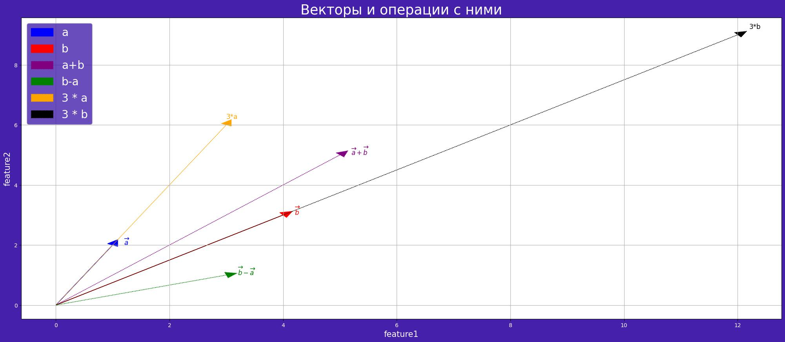
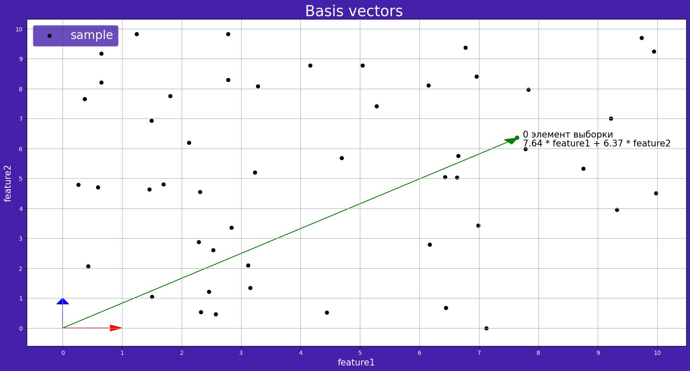
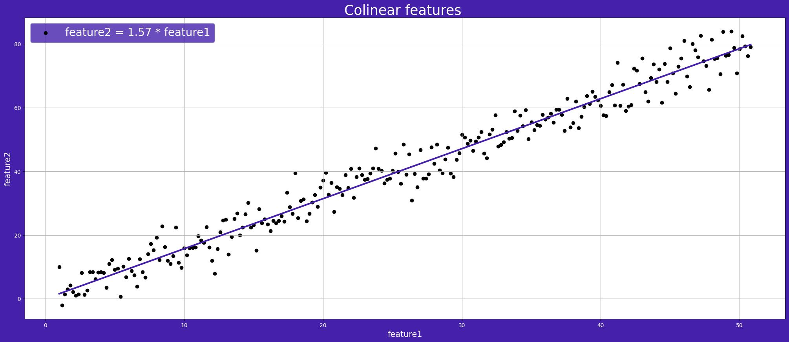
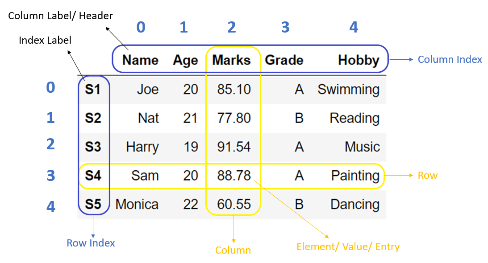
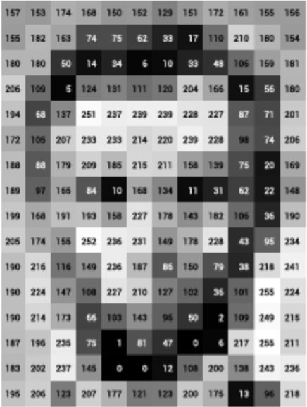
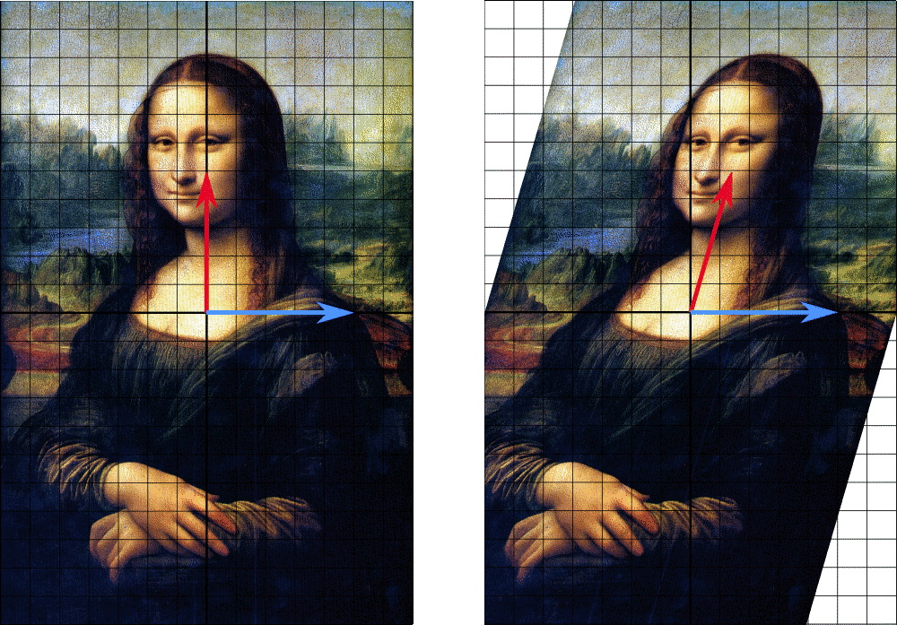

# Фаза 1 • Неделя 1 • Понедельник 

## Линейная алгебра • Linear Algebra

---
<!--- backgroundColor: white --->
<!--- paginate: true --->
<!-- header: "" -->

<h1> Вектор </h1>

  
  

  <b>Вектор</b> – элемент векторного пространства с произвольной размерностью по одному из измерений.
  
 
  

  _Основные операции на векторами:_ $\overrightarrow{A} = (a_{1}, a_{2}, a_{3}); \overrightarrow{B} = (b_{1}, b_{2}, b_{3})$
   __1. Cумма векторов__ $\overrightarrow{A} + \overrightarrow{B} = (a_{1} + b_{1}, a_{2} + b_{2}, a_{3} + b_{3});$
  __2.Разность векторов__$\overrightarrow{A} - \overrightarrow{B} = (a_1 - b_1, a_2 - b_2, a_3 - b_3);$ 
  __3.Произведение вектора__ $\overrightarrow{A}$ на число $\lambda$: $\lambda \overrightarrow{A} = (\lambda a_1, \lambda a_2, \lambda a_3);$ 
  __4.Длина (норма) вектора__ $|\overrightarrow{A}| = \sqrt{a_1^2 + a_2^2 + a_3^2};$
  
   __5.Скалярное произведение векторов__ $\overrightarrow{A}$ и $\overrightarrow{B}$: $(\overrightarrow{A}, \overrightarrow{B}) = |\overrightarrow{A}| \boldsymbol{\cdot} |\overrightarrow{B}| \boldsymbol{\cdot} \cos\angle(\overrightarrow{A}, \overrightarrow{B});$
   __6.Скалярное произведение через координаты:__ $(\overrightarrow{A}, \overrightarrow{B}) = \sum_{i=1}^{n} a_i b_i;$ 
  
   __7.Косинусное сходство:__ $\cos\angle (\overrightarrow{A}, \overrightarrow{B}) = \dfrac{a_1b_1 + a_2b_2 + a_3b_3}{\sqrt{a_1^2 + a_2^2 + a_3^2} \cdot \sqrt{b_1^2 + b_2^2 + b_3^2}};$
  

  

<!-- _footer:  📝 [Векторы в линейной алгебре](https://www.youtube.com/watch?v=TJGH_5VMAL4&t=36s) -->

---

<h1>Векторное пространство</h1>

<b>Векторное пространство</b> – пространство всех векторов, для которых определены операции выше. Так же хороший способ визуализации

 
  

    

       
      
    

    

      <table>
      <thead>
        <tr><th></th><th> feature1 </th> <th> feature2 </th></tr>
      </thead>
      <tbody>
        <tr><td>a</td><td> 1 </td> <td> 2 </td></tr>
        <tr><td>b</td> <td>4</td><td> 3 </td></tr>
      </tbody>
      </table>
    

    

  

    
4D и выше явной возможности отобразить у нас нет, однако все операции над векторами все так же продолжают работать

  

---
<h1>Базис векторного пространства</h1>

<b>Базис векторного пространства</b> – такой набор векторов в пространстве, что любой вектор этого пространства может быть единственным образом представлен в виде линейной комбинации векторов из этого набора. 

 
  

    

       
      
    

    

      <table>
      <thead>
        <tr><th></th><th> feature1 </th> <th> feature2 </th></tr>
      </thead>
      <tbody>
        <tr><td>0</td><td> 7.64	</td> <td> 6.37  </td></tr>
        <tr><td>1</td><td> 7.12	</td> <td> 0.00  </td></tr>
        <tr><td></td><td> ... </td> <td> ...    </td></tr>
        <tr><td>48</td><td> 3.28</td> <td>  8.08 </td></tr>
        <tr><td>49</td><td> 0.37</td> <td>  7.65 </td></tr>
      </tbody>
      </table>
    

    

  

    

  

---
<!--- backgroundColor: white --->
<!--- paginate: true --->
<!-- header: "" -->

<h1> Коллинеарные векторы </h1>

  

    Векторы называются <b>колинеарными</b>,  если один можно выразить линейным образом через другой
  

  

    

       
      
    

    

      <table>
      <thead>
        <tr><th> feature1 </th> <th> feature2 </th></tr>
      </thead>
      <tbody>
        <tr><td> 1.0 </td> <td> 1.469590 </td></tr>
        <tr><td> 1.2 </td> <td> 4.942208 </td></tr>
        <tr><td> ... </td> <td> ...      </td></tr>
        <tr><td> 50.6</td> <td> 79.625369</td></tr>
        <tr><td> 50.8</td> <td> 81.806239</td></tr>
      </tbody>
      </table>
    

    

  

    
векторы <b>feature1</b> и <b>feature2</b> коллинеарны.

  

<!-- _footer:  📝 [Проблема мультиколлинеарности в Data Science](https://habr.com/ru/companies/akbarsdigital/articles/592493/) -->

---
# Матрицы

* <b>Матрица</b> прямоугольная структура хранения данных. Матрицу можно трактовать как совокупность векторов, И использовать для хранения данных.

---

# Table data to matrix

* Содержимое таблицы в данном случае является матрицей

---

# Text to matrix

0. I like this movie, it's funny. 
1. I hate hate this movie movie. 
2. This was awesome! I like it. 
3. Nice one. I love love love it. 

| | awesome | funny | hate | it | like | love | movie | nice | one | this | was |
|-|---------|-------|------|----|------|------|-------|------|-----|------|-----|
|0|    0    |   1   |   0  |  1 |   1  |  0   |  1    |  0   | 0   |  1   |  0  |
|1|    0    |   0   |   2  |  0 |   0  |  0   |  2    |  0   | 0   |  1   |  0  |
|2|    1    |   0   |   0  |  1 |   1  |  0   |  0    |  0   | 0   |  1   |  1  |
|3|    0    |   0   |   0  |  1 |   0  |  3   |  0    |  1   |  1  |  1   |  0  |

* при изучениии NLP вы будете изучать разные способы text to Matrix

---

# image to Matrix

* Каждое значение интенсивность пикселя в конкретной координате

---

# Основные виды матриц

- если $m = n$, то матрица квадратная

$
\begin{pmatrix}
a_{11} & a_{12}  & a_{13}\\ 
a_{21} & a_{22} & a_{23} \\ 
a_{31} & a_{22} & a_{33}
\end{pmatrix}
$

- если все элементы матрицы равны нулю, то матрица нулевая
$0_1 = |0|, 0_2 = \begin{pmatrix} 0 & 0 \\ 0 & 0 \end{pmatrix}$
- если элементы главной диагонали матрицы равны 1, а остальные нулю, то матрица едничиная
$
I_1=
\begin{pmatrix}
1 & 0  \\ 
0 & 1  \\ 
\end{pmatrix}
I_3=
\begin{pmatrix}
1 & 0  & 0\\ 
0 & 1 & 0 \\ 
0 & 0 & 1
\end{pmatrix}
$

---

<!-- _footer: 📝[Essential Math for Data Science: Introduction to Matrices and the Matrix Product](https://www.kdnuggets.com/2021/02/essential-math-data-science-matrices-matrix-product.html) -->

# Операции над матрицами

* Самая важная операция - матричное умножение 

* Умножение матриц доступно только в случае, если кол-во столбцов первой матрицы совпадает с количеством строк второй матрицы

--- 

# Операции над матрицами

$$ 
\begin{pmatrix}
a & b \\
c & d
\end{pmatrix} \bullet 
\begin{pmatrix}
x_1  & x_2\\
y_1  & y_2
\end{pmatrix} = 
\begin{pmatrix}
ax_1 + by_1 & ax_2 + by_2\\
cx_1 + dy_1 & cx_2 + by_2
\end{pmatrix}
$$

$$ 
A = 
\begin{pmatrix}
3 & 1 \\ 
1 & 2 
\end{pmatrix}
B = 
\begin{pmatrix}
-1 & 1\\ 
2  & 1
\end{pmatrix}
$$

$$
A \boldsymbol{\cdot} B = ?
$$

---

# Операции над матрицами

$$ 
\begin{pmatrix}
a & b \\
c & d
\end{pmatrix} \bullet 
\begin{pmatrix}
x_1  & x_2\\
y_1  & y_2
\end{pmatrix} = 
\begin{pmatrix}
ax_1 + by_1 & ax_2 + by_2\\
cx_1 + dy_1 & cx_2 + by_2
\end{pmatrix}
$$

$$ 
A = 
\begin{pmatrix}
3 & 1 \\ 
1 & 2 
\end{pmatrix}
B = 
\begin{pmatrix}
-1 & 1\\ 
2  & 1
\end{pmatrix}
$$

$$
A \boldsymbol{\cdot} B = 
 \begin{pmatrix}
 -1 & 4 \\
  3 & 3
 \end{pmatrix}
$$

---

<!-- _footer: ©️[A Geometrical Understanding of Matrices](http://gregorygundersen.com/blog/2018/10/24/matrices/) 📊[Linear Transformation Visualizer - Inspired by 3Blue1Brown](https://shad.io/MatVis/)-->

# Матрица как линейный оператор

Матрицу можно воспринимать как __объект линейной трансформации__ входного объекта путем линейных преобразований.

<!--  -->
 

---

<!-- _footer:  📊[Linear Transformation Visualizer - Inspired by 3Blue1Brown](https://shad.io/MatVis/)-->

# Линейные операторы

* Данная матрица делает поворот на 180 градусов, а также растягивает пространство в два раза вдоль обеих координат.

--- 

# Транфсформация в изображениях

<!-- _footer:  📊[Здесь можно попробовать разные трансформации](https://web.ma.utexas.edu/users/ysulyma/matrix/) -->

---

Предположим, существует линейный оператор 
$$\mathbf{A}(v) = 2v$$

Его можно записать в матричном виде. Если есть базис $e_1=\begin{pmatrix}1 \\ 0 \end{pmatrix}, \; e_2=\begin{pmatrix}0\\ 1\end{pmatrix}$ в двумерном пространстве, применяем оператор к базисным векторам: 
 - $\mathbf{A}(e_1) = 2\begin{pmatrix}1 \\ 0 \end{pmatrix} \rightarrow \mathbf{A} = \begin{pmatrix} 2 & * \\ 0 & * \\\end{pmatrix}$ 
 
 - $\mathbf{A}(e_2) = 2\begin{pmatrix}0 \\ 1 \end{pmatrix} \rightarrow \mathbf{A} = \begin{pmatrix} 2 & 0 \\ 0 & 2 \\\end{pmatrix}$

--- 

- Дан вектор $c = \begin{pmatrix}-1 \\ 3 \end{pmatrix}$, матрица линейного преобразования $\mathbf{A}(v) = 2v$ 

Решение: 

$\mathbf{A}(c) = \begin{pmatrix} 2 & 0 \\ 0 & 2 \\\end{pmatrix}
                 \begin{pmatrix} -1 \\ 3 \\\end{pmatrix} = 
                 \begin{pmatrix} -2 \\ 6 \\\end{pmatrix}$

--- 

$\mathbf{A}(v) = kv$ –  преобразование подобия:
 - если $k > 1$, то объект растягивается в $k$ раз
 - если $0 < k < 1$, то объект сжимается в $k$ раз
 - если $k=1$, то преобразование тождественно
 - если $k < 0$, то ?

---

Что произойдет с объектом, если применить к нему следующие преобразования:

 - $\mathbf{A}_1 = \begin{pmatrix} 0.3 & 0 \\ 0 & 1 \end{pmatrix}$
 - $\mathbf{A}_2 = \begin{pmatrix} 1 & 0 \\ 0 & 1.5 \end{pmatrix}$
 - $\mathbf{A}_3 = \begin{pmatrix} 1 & 1 \\ 0 & 1 \end{pmatrix}$
 - $\mathbf{A}_4 = \begin{pmatrix} \cos\alpha & -\sin\alpha \\ \sin\alpha & \cos\alpha \end{pmatrix}$

 ---

 # Итоги

 * Матрицы, векторы и операции над ними - ключевое в линейной алгебре
 * Многие алгоритмы машинного обучения и глубокого обучения - сплошное перемножение матриц
 * Для матриц полезными характеристиками также являются __ранг матрицы, определитель матрицы, обратная матрица.__ Это остается на самоизучение в силу достаточной простоты. Короткие видео в плейлисте ниже помогут вам в этом.
 
 * https://www.youtube.com/playlist?list=PLVjLpKXnAGLXPaS7FRBjd5yZeXwJxZil2