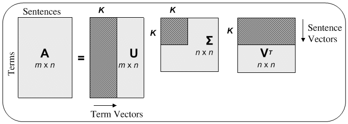
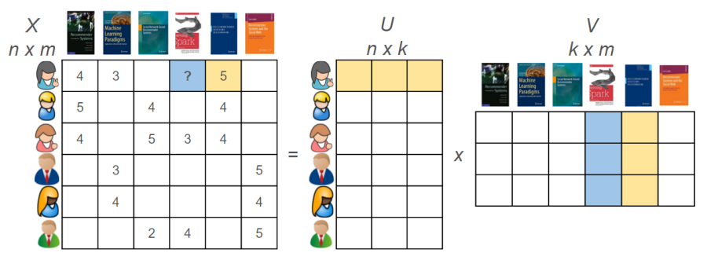
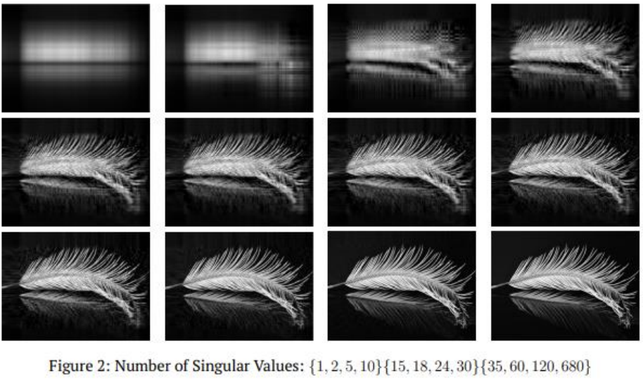

# Фаза 1 • Неделя 1 • Вторник 
 
## Линейная алгебра • Linear Algebra

### PCA и SVD

---
# Пониженние размерности с помощью PCA

* __PCA(principal component analysis)__ или иначе говоря - метод главных компонент. Этот алгоритм позволяет перейти от пространств больших размерностей, к пространствам меньших размерностей, пытаясь сохранить ключевую информацию. 

* ниже пример понижения __3D -> 2D__

---
# Пониженние размерности с помощью PCA 

* __2D -> 1D__

> 🔥`sklearn.decomposition.PCA`

<!-- _footer: ©️📝[PCA animation (Singular Value Decomposition)](aux/pca.gif) -->

---

# Алгоритм понижения размерности PCA

1.Нормировка данных(StandardScaler)
2.Взять матрицу ковариаций
3.Cобственные числа и собственные векторы
4. Взять топ <b>k</b> собственных чисел и соответствующих им собственных векторов
5. Умножить исходную матрицу признаков (<b>mxn * nxk = mxk</b>)
6. Итоговая матрица __mxk__ и есть результат понижения 

---

# Сингулярное разложение матрицы / SVD 

* _SVD_ позволяет разложить одно матричное преобразование __M__ на произведение трех простых $M = U * \Sigma * V$

--- 

<!-- _footer: ©️📝[Recommender Systems with Python — Part III: Collaborative Filtering (Singular Value Decomposition)](https://heartbeat.fritz.ai/recommender-systems-with-python-part-iii-collaborative-filtering-singular-value-decomposition-5b5dcb3f242b) -->

# SVD в рекомендательных системах

* Пример применения матричных разложений в рекомендательных системах

--- 

# SVD в изображениях

