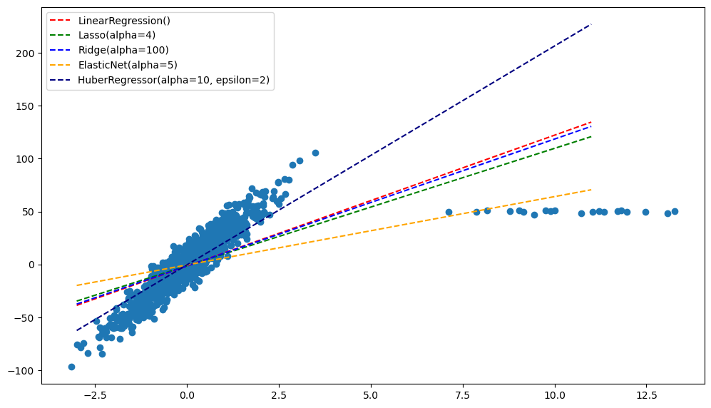
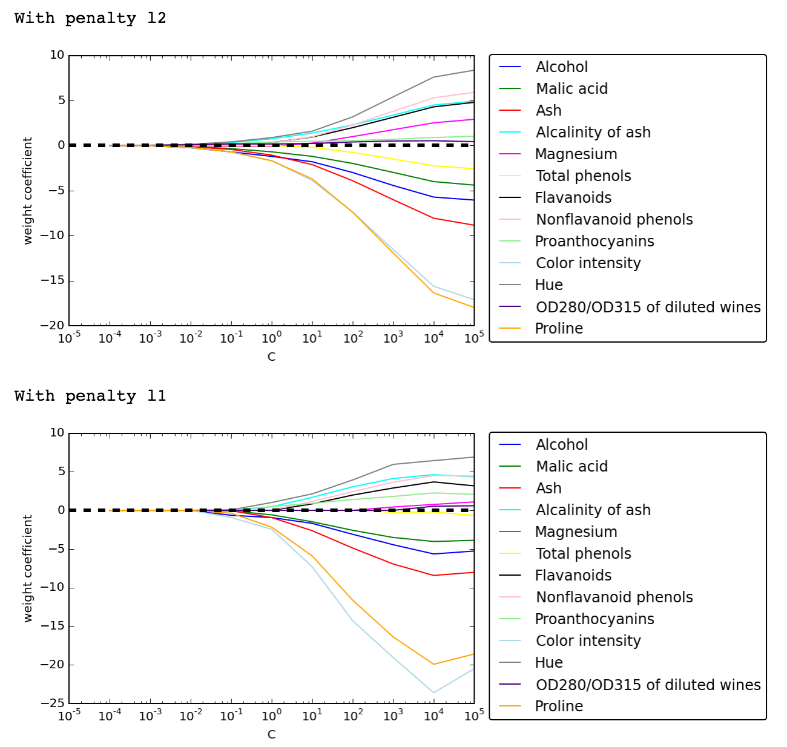

# Фаза 1 • Неделя 2 • Четверг 

##  Линейная регрессия / Machine learning

---

<!--- backgroundColor: white --->
<!--- paginate: true --->
<!-- header: "" -->

# Сегодня

- Краткий экскурс в историю 
- Виды задач в машинном обучении 
- Примеры результатов

--- 
<!-- _footer: 📝 [Машинное обучение для людей](https://vas3k.ru/blog/machine_learning/) -->

# Машинное обучение

---

<!-- _footer: 📝[Machine Learning vs. Traditional Programming Paradigm](https://datalya.com/blog/machine-learning/machine-learning-vs-traditional-programming-paradigmm) 
-->

# Программирование vs. Машинное обучение

--- 

# Линейная регрессия

__Задача__: оценить стоимость квартиры по одному признаку (например, площади). 
Дана таблица с обучающей выборкой: 

| Площадь, м2 | Цена, млн |
|-------------|-----------|
| 50          | 12        |
| 33          |  8        | 
| ...         | ...       | 
| 76          | 120       |

---

# Линейная регрессия 

Решаем уравнение: 
$$y = x_1w_1 + w_0$$
где $x_1$ - значение площади, $w$ - "вес" признака, $w_0$ - свободный параметр. 

Если помимо площади есть еще признаки, то уравнение просто увеличивается: 
$$y = x_1w_1 + x_2w_2 + \dots + x_nw_n + w_0$$ 

или короче: 
$$y = \sum_{i=1}^{n}x_iw_i + w_0$$

---

# Линейная регрессия: решение
* методом градиентного спуска (так обычно и происходит)
    * будем минимизировать _среднеквадратическую ошибку_: 
    $$L = \frac{1}{K}\sum_{i=1}^{K}(y_i - \hat{y}_i)^2 \rightarrow \min$$

    $$L = \frac{1}{K}\sum_{i=1}^{K}(y_i - (x_1 \cdot w_1 + x_2 \cdot w_2 + ... + x_n \cdot w_n))^2 \rightarrow \min$$
    $y$ - настоящее значение, $\hat{y}$ - предсказанное моделью значение, $K$ - число объектов в обучающей выборке, $w_1, w_2, ..., w_n$ - веса признаков, это и есть наши дифферинцируемые парамаметры, частные производные по ним будут составлять наш градиент.

--- 

<!-- _footer: 📝 [Линейная регрессия (Linear regression) ](https://wiki.loginom.ru/articles/linear-regression.html) -->
# Линейная регрессия: решение

--- 

<!-- _footer: 📝 [Линейная регрессия - понимание теории](https://www.machinelearningmastery.ru/linear-regression-understanding-the-theory-7e53ac2831b5/) -->

# Регуляризация линейных моделей 

* Часто модель может переобучиться на какие-либо выбросы в данных
* Чтобы этого избежать, можно использовать регуляризацию: 
чаще всего это добавление в функцию ошибки каких-либо значений. 
* Три самых распространенных метода регуляризации моделей: 
  1. $L1$-регуляризация / LASSO: добавляем в функцию ошибки сумму модулей коэффициентов: 
  $$L(y, \hat{y}) = \frac{1}{K} \sum_{i=1}^{K}(y-\hat{y})^2 + \alpha||w||_1$$

$\alpha$ - коэффициент регуляризации

---

# Регуляризация линейных моделей 

* Часто модель может переобучиться на какие-либо выбросы в данных
* Чтобы этого избежать, можно использовать регуляризацию: 
чаще всего это добавление в функцию ошибки каких-либо значений. 
* Три самых распространенных метода регуляризации моделей: 
  2. $L2$-регуляризация / Ridge: добавляем в функцию ошибки сумму квадратов коэффициентов: 
  $$L(y, \hat{y}) = \frac{1}{K} \sum_{i=1}^{K}(y-\hat{y})^2 + \alpha||w||_2$$

$\alpha$ - коэффициент регуляризации

---

# Регуляризация линейных моделей 

* Часто модель может переобучиться на какие-либо выбросы в данных
* Чтобы этого избежать, можно использовать регуляризацию: 
чаще всего это добавление в функцию ошибки каких-либо значений. 
* Три самых распространенных метода регуляризации моделей: 
  2. ElasticNET: добавляем в функцию ошибки сумму квадратов и сумму модулей коэффициентов: 
  $$L(y, \hat{y}) = \frac{1}{K} \sum_{i=1}^{K}(y-\hat{y})^2 + \alpha||w||_2 + \beta||w||_1

$\alpha$ - коэффициент регуляризации

---

<!-- _footer: 📝 [The Art of Regularization](https://medium.datadriveninvestor.com/the-art-of-regularization-caca8de7614e) -->

# Регуляризация линейных моделей 

---

# Регуляризация линейных моделей 

--- 

# LASSO как способ отбора признаков

<!--  -->

--- 
# Логистическая регрессия

<!-- Логистическая регрессия - метод __классификации__!  -->

* Решает задачу классификации, не смотря на название!

--- 
# Логистическая регрессия

Модель остается линейной: 
$$z = \sum_{i=1}^{n}x_iw_i + w_0$$ 

но полученный $z$ подставляем в _логистическую_ функцию: 
$$y = \dfrac{1}{1 + e^{-z} }$$

выход $y$ будет лежать в диапазоне от 0 до 1: $y \in [0, 1]$

это значение мы будем интерпретировать как _вероятность_ того, что объект относится к классу __1__

--- 
<!-- _footer: 📝 [[Understanding Logistic Regression using R](https://www.excelr.com/blog/data-science/regression/understanding-logistic-regression-using-r#) -->

# Логистическая регрессия 

* Все положительные значения будут иметь вероятность больше 0.5
* Все отрицательные значения будут иметь вероятность меньше 0.5

---

# Нормализация признаков

* __Standart Scaler__ используем: 
  * когда данные нормально или почти нормально распределены
* __MinMax Scaler__ используем:
  * когда данные распределены не нормально
  * когда стандартное отклонение слишком маленькое
* __Robust Scaler__ используем
  * когда в данных есть выбросы

---
<!-- _footer: 📝©️[Feature Scaling with Scikit-Learn](https://michael-fuchs-python.netlify.app/2019/08/31/feature-scaling-with-scikit-learn/) -->

# Нормализация признаков

--- 

# Нормализация признаков

* В случае линейной регресии позволяет интерпретировать коэффициенты линейной регресии
* В случае __любых__ алгоритмов, вычисляющих расстояние, нормализует вклад каждого измерения в итоговое расстояние

