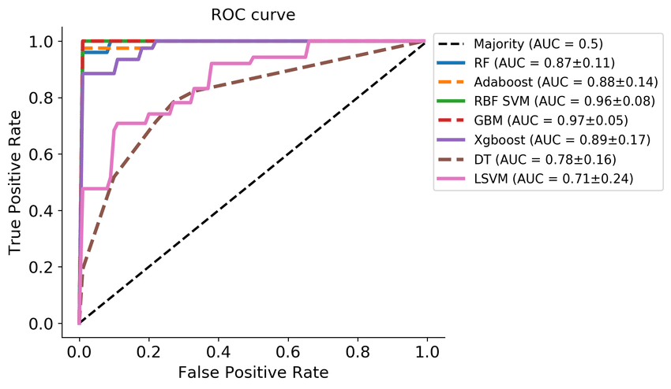
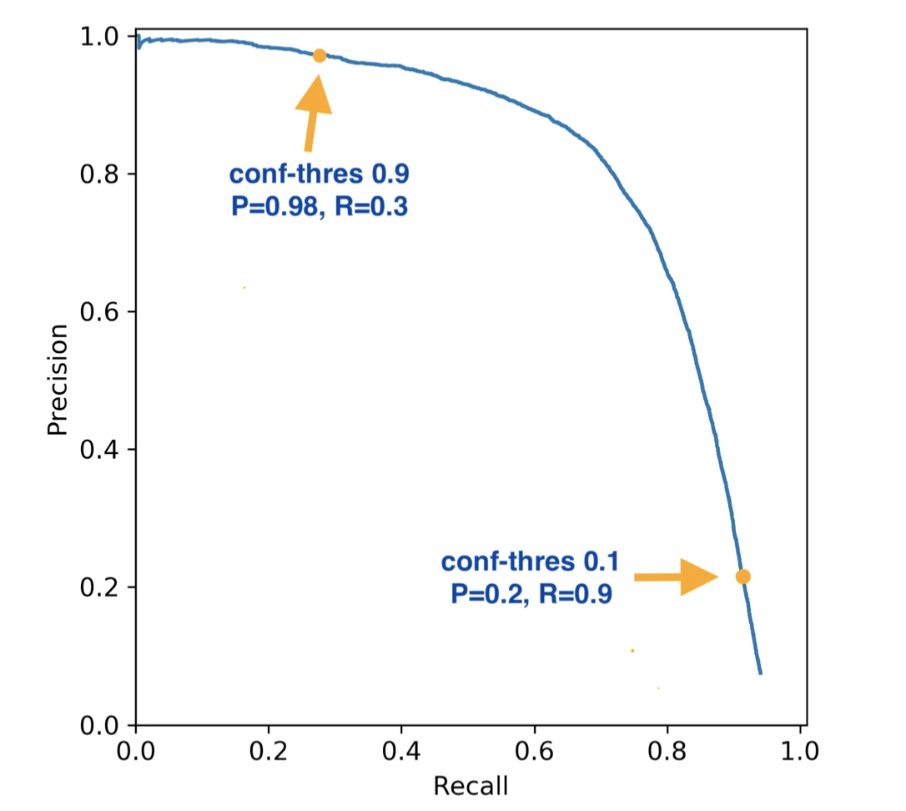

# Фаза 1 • Неделя 3 • Четверг

## Метрики классификации и регрессии • Metrics

--- 

# Сегодня

* как измерить, что алгоритм хорошо решает задачу? 
* как сравнить несколько алгоритмов между собой и выбрать лучший? 
* как выбрать правильный способ оценки и от чего это зависит?

<!--- backgroundColor: white --->
<!--- paginate: true --->
<!--- header: "" --->

---

# Метрики классификации 

- _True Positive / **TP** / Истинно-положительное_: классификатор отнес объект к классу `cat` и объект действительно относится к классу `cat` 
- _False Positive / **FP** / Ложно-положительное_: классификатор отнес объект к классу `cat`, но на самом деле объект не относится к этому классу
- _False Negative / **FN** / Ложно-отрицательное_: классификатор отнес объект к классу `non cat`, но на самом деле объект относится к классу `cat` 
- _True Negative / **TN** / Истинно-отрицательное_: классификатор отнес объект к классу `non cat`, и объект действительно относится к этому классу 

--- 

# Метрики классификации 

### Accuracy

$$ACC = \dfrac{TP + TN}{TP + FP + FN + TN}$$
 
 

> Если выборка несбалансирована, то эта метрика ничего не покажет

--- 

# Метрики классификации 
### Precision 
$$precision = \dfrac{TP}{TP+FP}$$ 

--- 

# Метрики классификации 
### Recall

$$recall = \dfrac{TP}{TP + FN}$$

--- 

# Метрики классификации 

### F1-score

$$f1 = 2\times \frac{precision\times recall}{precision+recall}$$

 
 

> гармоническое среднее между точностью и полнотой

--- 
<!-- _footer: 📝 [Micro Average vs Macro average Performance in a Multiclass classification setting](https://datascience.stackexchange.com/questions/15989/micro-average-vs-macro-average-performance-in-a-multiclass-classification-settin) -->
# Метрики классификации 

* Часто метрики _precision, recall_ и _f1_ можно встретить с приставкой _micro_ или _macro_
* Посмотрим на примере _precision_

--- 
<!-- _footer: 📝 [Micro Average vs Macro average Performance in a Multiclass classification setting](https://datascience.stackexchange.com/questions/15989/micro-average-vs-macro-average-performance-in-a-multiclass-classification-settin) -->
# Метрики классификации 

--- 

# Метрики классификации 
### ROC-AUC
Для вычисления ROC-AUC используются две дополнительные метрики: 
 
* True positive rate: $TPR = \dfrac{TP}{TP+FN}$  __(a.k.a Recall)__
 
 
* False positive rate: $FPR = \dfrac{FP}{FP+TN}$

--- 
<!-- _footer: 📝[AUC ROC (площадь под кривой ошибок)](https://dyakonov.org/2017/07/28/auc-roc-%D0%BF%D0%BB%D0%BE%D1%89%D0%B0%D0%B4%D1%8C-%D0%BF%D0%BE%D0%B4-%D0%BA%D1%80%D0%B8%D0%B2%D0%BE%D0%B9-%D0%BE%D1%88%D0%B8%D0%B1%D0%BE%D0%BA/) 📊[ROC, AUC, precision, and recall visually explained](https://paulvanderlaken.com/2019/08/16/roc-auc-precision-and-recall-visually-explained/)-->
# Метрики классификации 
### ROC-AUC

--- 
# ROC-AUC пример графика

---
# PR-AUC

---

# Метрики регрессии
### Mean Squared Error

$y$ – истинные значение целевой переменной 

$\hat{y}$ – предикт алгоритма 

$N$ – число объектов в выборке

$$MSE = \dfrac{1}{N} \sum_{i=1}^{N}(y_i - \hat{y}_i)^2$$

> MSE применяется в ситуациях, когда нам надо подчеркнуть большие ошибки и выбрать модель, которая дает меньше больших ошибок прогноза.

--- 
# Метрики регрессии
### Root Mean Squared Error

$$RMSE = \sqrt{\dfrac{1}{N} \sum_{i=1}^{N}(y_i - \hat{y}_i)^2}$$

> Легко интерпретировать, поскольку он имеет те же единицы, что и исходные значения (в отличие от MSE). 

--- 
# Метрики регрессии
### Mean Absolute Error

$$MAE =\dfrac{1}{N} \sum_{i=1}^{N}|y_i - \hat{y}_i|$$

> Среднеквадратичный функционал сильнее штрафует за большие отклонения по сравнению со среднеабсолютным, и поэтому более чувствителен к выбросам.

--- 
# Метрики регрессии

### Mean Absolute Percentage Error 

$$MAPE = \dfrac{1}{N} \sum_{i=1}^{N} \left| \dfrac{y_i - \hat{y}_i}{y_i} \right| \times 100$$

> Этот коэффициент можно интерпретировать в долях или процентах. Если  получилось, например, что MAPE=11.4%, то это говорит о том, что ошибка составила 11,4% от фактических значений. 

--- 
<!-- _footer: 📝[Symmetric mean absolute percentage error](https://en.wikipedia.org/wiki/Symmetric_mean_absolute_percentage_error) -->
# Метрики регрессии
### Symmetric mean absolute percentage error

$$SMAPE = \dfrac{100\%}{N} \sum_{i=1}^{N} \dfrac{|\hat{y}_i - y_i|}{|y_i| + |\hat{y}_i|}$$

--- 
# Метрики регрессии
### R2 score

$$R^2  = 1 - \dfrac{\sum_{i=1}^{N} (y_i - \hat{y}_i)^2}{\sum_{i=1}^{N} (y_i - \bar{y})^2}$$

---
<!-- _footer: 📝[Rosneft Proppant Check Challenge](https://boosters.pro/championship/RPCC/metric) 📝[Хакатон трех городов](https://boosters.pro/championship/hackathon-three-cities/metric)  -->
# Итоги

* выбор метрики __всегда__ зависит от задачи
* метрика $\neq$ функция потерь
  * функцию потерь мы минимизируем по параметрам модели
  * метрикой мы измеряем, насколько качественно работает модель
* `sklearn:` [Metrics and scoring: quantifying the quality of predictions](https://scikit-learn.org/stable/modules/model_evaluation.html)