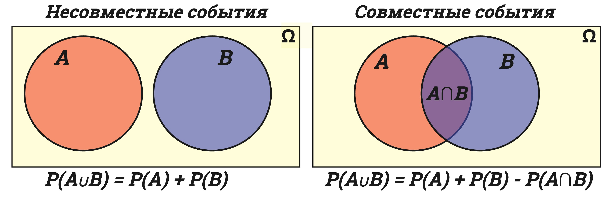
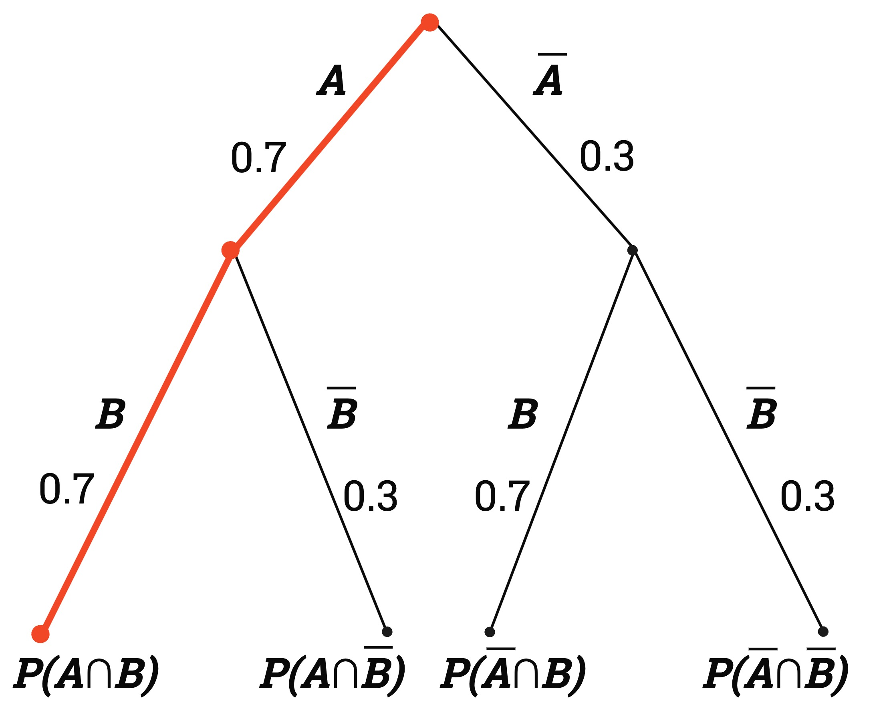
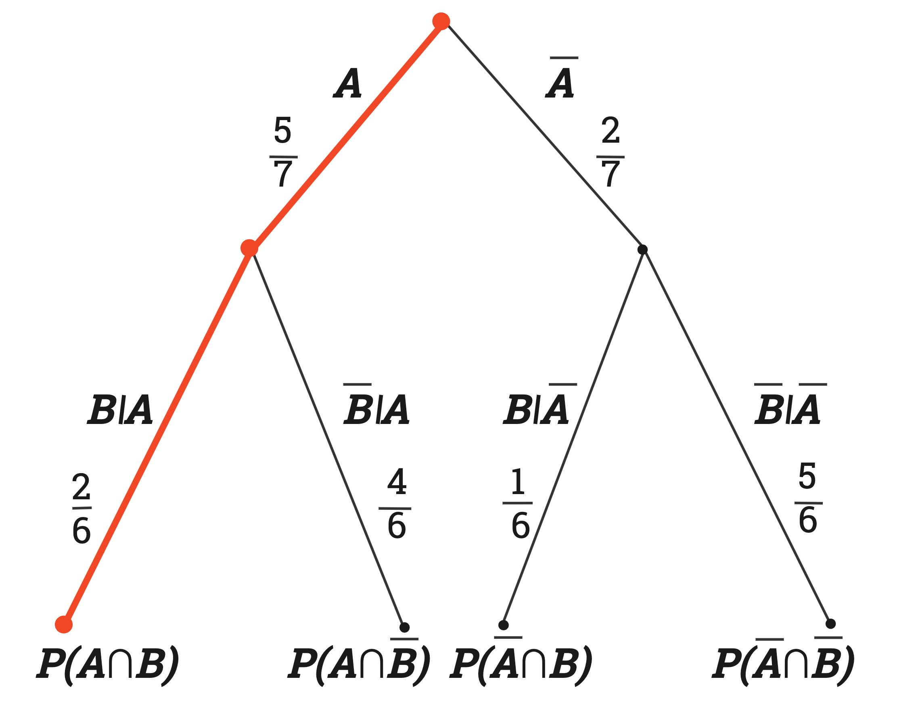
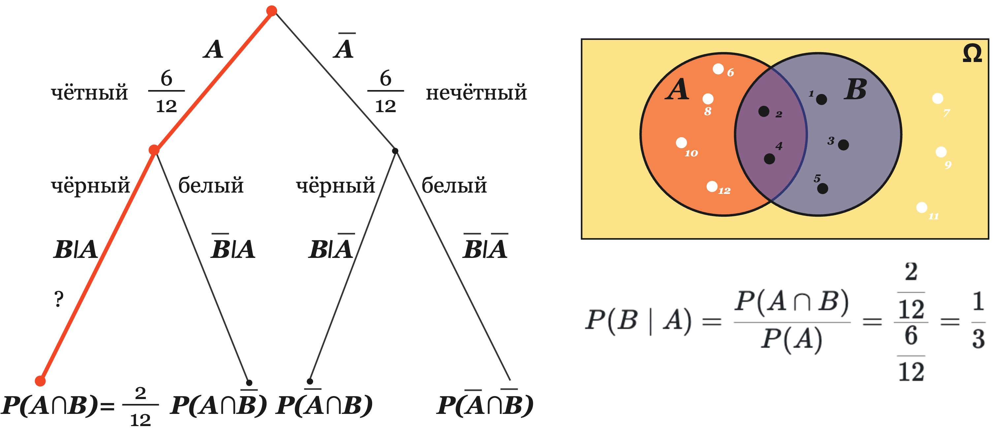
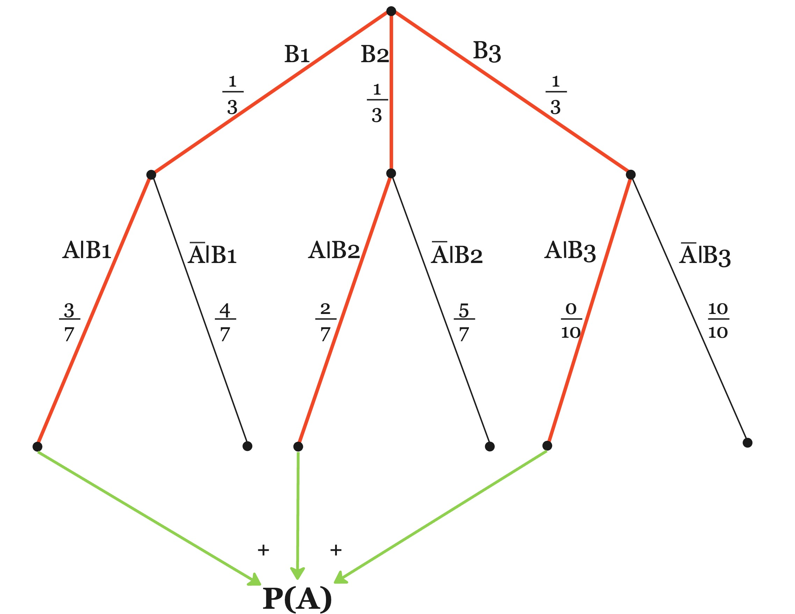
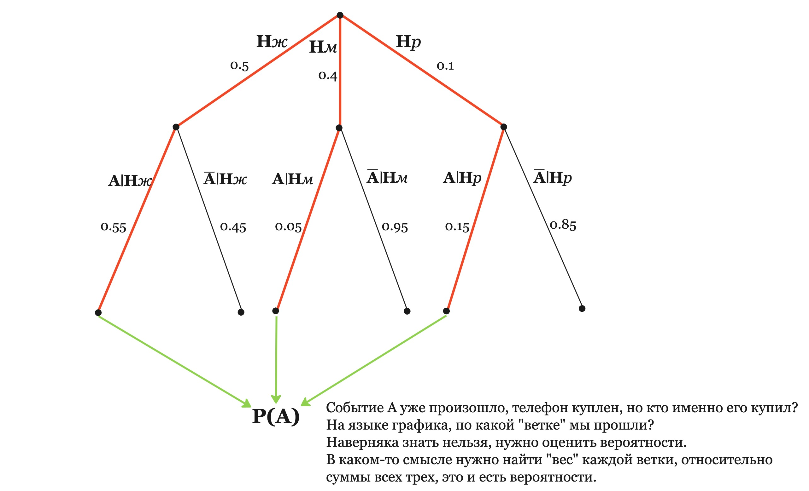

# Фаза 1 • Неделя 1 • Понедельник

##  Теория вероятностей • Probability

---

<!--- backgroundColor: white --->
<!--- paginate: true --->
<!-- header: "" -->

# Сегодня 

* область применения теории вероятностей
* основные термины в теории вероятностей
* понятие условной и полной вероятности
* формула Байеса

---

# Чем занимается теория вероятностей? 

> Теория вероятностей изучает случайные события, величины, их свойства и возможные операции. 
> Теория вероятностей необходима для принятия рациональных решений

---
# Основные термины теории вероятностей 

* **элементарный исход**(${\omega}$) - исход нашего опыта
например если мы бросаем две монетки - элементарным исходом будет вектор ${\omega} = (\mathrm{i}_1, \mathrm{i}_2)$
* **пространство элементарных исходов**(**ПЭИ**)(${\Omega}$) - все возможные элементарные исходы
* **событие**(**A**={${\omega_1}$, ${\omega_2}$, ...}) - некоторая совокупность **элементарных исходов**, например при броске двух монеток, событие **A** - "Хотя бы один орел". 
* **вероятность**: $P={\dfrac{|A|}{|\Omega|}}$(Количество подходящих исходов/общее количество исходов) 
---

# Классификация событий

1.  **Совместные и несовместные** 
    * **совместные события** – события, одновременное появление которых возможно. 
    * **несовместные события** события – события, одновременное появление которых невозможно. 
2.  **Зависимые/независимые** 
    * **Зависимые события** – появление одного события влияет на появление другого события.
    * **Независимые события** – появление одного события не влияет на появление другого.
3. **Полная группа событий** – образуется, если в результате испытания обязательно наступает одно из событий. 

--- 
# Примеры

* В мешке 5 черных и 4 белых шара. Событие $A$ – первым достали черный шар. Событие $B$ – вторым достали белый шар. Какого класса это событие?

* На улице безоблачно и идет дождь. 

* Наступило утро и идет дождь. 

* Студент на зачете: сдаст или нет. 

--- 

# Совместные и несовместные

Если события $A$ и $B$ *не совместные*, то вероятность возникновения хотя бы одного из них: $P(A \cup B) = P(A) + P(B)$ 

"$\cup$" - объединение(аналог оператора **or** в *python*)

&nbsp; 
**Пример**: бросаем мы игральную кость.
Какова вероятность, что выпадет число либо 2, либо 4?
событие $A$ = "на кости выпало 2"
событие $B$ = "на кости выпало 4"
$P(A \cup B) = P(A) + P(B) = \dfrac{1}{6} + \dfrac{1}{6} = \dfrac{2}{6}$ 

---

# Совместные и несовместные

Если события **A** и **B**  *совместные*, то вероятность 
  $$P(A\cup B) = P(A) + P(B) - P(A \cap B)$$

$\cap$ - пересечение (аналог оператора **and** в *python*)

❓ Какова вероятность, что на игральной кости выпадет число кратное 2 или 3?
$A$ = "на кости число, кратное двум"
$B$ = "на кости число, кратное трём"
$P(A\cup B) = P(A) + P(B) - P(A\cap B) = \frac{3}{6} + \frac{2}{6} - \frac{1}{6} = \frac{4}{6}$

Обобщением для произвольного количества событий(A, B, C, D ...) **служит Формула включений исключений:**
P(**A**$\cup$ **B**$\cup$ **C**) = P(**A**) + P(**B**) + P(**C**) - P(**A**$\cap$**B**)- P(**A**$\cap$**C**)- P(**B**$\cap$**C**) + P(**A**$\cap$ **B**$\cap$ **C**)
и так далее формула рекуррентно продолжается для большего числа событий

---
# Совместные и несовместные

Графически *совместность/несовместность* выглядела бы примерно так и это называют кругами **Эйлера** или диаграммой **Венна**:

---

# Независимые события

Если события $A$ и $B$ *независимые*, то вероятность их совместного наступления:

$$P(A \cap B) = P(A) \times P(B)$$

&nbsp;

**Пример**: Классификатор правильно классифицирует объект с вероятностью 0.7. Какова вероятность, что он правильно классифицирует два объекта подряд?

A - "Первый объект правильно классифицирован"
B - "Второй объект правильно классифицирован"

$$P(A \cap B) = P(A) \times P(B) = 0.7 \times 0.7 = 0.49$$

---
# Независимые события 

Визуализация независимости событий по задаче выше

P(**A**$\cap$**B**) = P(**A**) * P(**B**) = 0.7 * 0.7 = 0.49

> Можно увидеть, что на классифицирование второго объекта($B$), никаким образом не влияет классифицирование первого объекта($A$)
---

# Зависимые события

  Если события A и B *зависимые*, то вероятность их совместного наступления можно посчитать с помощью так называемых **условных вероятностей**:

$$P(A\cap B) = P(B) \times P(A|B) = P(A) \times P(B|A)$$

**Пример**: В урне 5 белых и 2 черных шара. Какова вероятность, что мы достанем сначала белый, потом черный шар?

A - "Первый шаром достали - белый"
B - "Вторым шаром достали - черный"

$$P(A\cap B) = P(A) \times P(B|A) = \dfrac{5}{7} \times \dfrac{2}{6} = \dfrac{10}{42} = \dfrac{5}{21}$$

---
# Зависимые события

Визуализация независимости событий по задаче выше

$$P(A \cap B) = P(A) \times P(B|A) = \dfrac{5}{7} \times \dfrac{2}{6} = \dfrac{10}{42} = \dfrac{5}{21}$$

> Вероятности во второй попытке меняются в зависимости от первой

---

# Условная вероятность

**Условная вероятность** наступления события $A$ при совершившемся событии $B$: 

> $$P(A\mid B) = \dfrac{P(A \cap B)}{P(B)}$$

--- 
# Условная вероятность: пример

Пусть имеется 12 шариков, из которых 5 –  чёрные, а 7 – белые. Пронумеруем чёрные шарики числами от 1 до 5, а белые – от 6 до 12. Случайным образом из мешка достаётся шарик. Требуется посчитать вероятность того, что шарик чёрный, если известно, что он имеет чётный номер: $P(B\mid A)$

Событие $A$ – достали шар с четным номером.
Событие $B$ – достали черный шар. 
 

$P(A) = \dfrac{1}{2}$, потому что ровно половина шариков имеет четный номер. 
$P(A \cap B) = \dfrac{2}{12} = \dfrac{1}{6}$, потому что ровно два шарика из 12 имеют черный цвет и четный номер (2 и 4).

---

# Условная вероятность: пример 

---

# Полная вероятность

Формула полной вероятности позволяет вычислить вероятность события $A$ через вероятности его свершения при выполнении некоторых гипотез с заданной вероятностью. 

> $$P(A)=\sum_{i=1}^{n}P(A\mid B_i)P(B_i)$$ 

$n$ – число гипотез
$P(B_i)$ – вероятность $i$-ой гипотезы
Все $B_i$ являются полной группой событий

---

# Полная вероятность: пример

Имеются 3 одинаковые урны с шарами. В первой из них находится 3 белых и 4 черных шара, во второй — 2 белых и 5 чёрных, а в третьей — 10 чёрных шаров. Из случайно выбранной урны наудачу вынут шар. 
С какой вероятностью он окажется белым?

$B_i$ - "выбрана $i$-ая урна"

$A$ - "шар оказался белым"

Выбор урн равновероятен: $P(B_1) = P(B_2) = P(B_3) = \dfrac{1}{3}$
Условные вероятности: $P(A\mid B_1) = \frac{3}{7}, P(A\mid B_2) = \frac{2}{7}, P(A\mid B_3) = \frac{0}{10}$
Полная вероятность: $P(A) = \frac{1}{3} \cdot\frac{3}{7} + \frac{1}{3} \cdot \frac{2}{7} + \frac{1}{3} \cdot \frac{0}{10} \approx 0.24$

---

# Полная вероятность: пример

$P(A) = \frac{1}{3} \cdot\frac{3}{7} + \frac{1}{3} \cdot \frac{2}{7} + \frac{1}{3} \cdot \frac{0}{10} \approx 0.24$

---
#  Формула Байеса

---
# Формула Байеса

Формула позволяет определить вероятность какого-либо события при условии, что произошло другое статистически взаимозависимое с ним событие. 

Формулу удобно переписать немного с другими обозначениями: 

* $h$ – гипотеза, вероятность которой мы проверяем при условии наступления какого-либо события $A$. 

$$P(h \mid A) = \dfrac{P(A \mid h)P(h)}{P(A)}$$

Типичный вопрос, который звучит в задачах на формулу Байеса: 
> **Случилось какое-то событие А, какова вероятность, что этому предшествовали обстоятельства h?**

---
# Формула Байеса: пример

В онлайн-магазине было проведено исследование продаж розовых телефонов. Выяснилось, что посетители женщины этот телефон покупают в 55% случаях, мужчины – в 5% случаях и дети – в 15% случаях. Среди посетителей салона 50% женщин, 40% мужчин и 10% детей. 

> **Был продан розовый телефон ($A$), какова вероятность, что его купила женщина ($h$)?**

---

# Формула Байеса: пример

Распишем гипотезы и события: 

* Событие $A=\{\text{куплен розовый телефон}\}$ 
* Гипотезы: 
  * $P(h_1) = P(\{\text{магазин посетила женщина}\})=0.5$
  * $P(h_2) = P(\{\text{магазин посетил мужчина}\})=0.4$
  * $P(h_3) = P(\{\text{магазин посетил ребенок}\})=0.1$
* Условные вероятности: 
  * $P(A \mid h_1) = 0.55$ 
  * $P(A \mid h_2) = 0.05$
  * $P(A \mid h_3) = 0.15$

---

# Формула Байеса: пример

* Событие $A=\{\text{куплен розовый телефон}\}$ 
* Гипотезы: $P(h_ж) = 0.5, P(h_м) = 0.4, P(h_р) = 0.1$
* Усл. вероятности: $P(A \mid h_ж) = 0.55, P(A \mid h_м) = 0.05, P(A \mid h_р) = 0.15$

$$P(h_1\mid A) = \dfrac{P(A \mid h)P(h)}{P(A)} = \dfrac{P(A \mid h_1)P(h_1)}{P(A \mid h_1)P(h_1) + P(A \mid h_2)P(h_2) + P(A \mid h_3)P(h_3)} =  \dfrac{0.55 \times 0.5}{0.31} \approx 0.89$$

> Нарисуем дерево?

---

# Формула Байеса: пример

--- 

# Формула Байеса: задача

При рентгеновском обследовании вероятность обнаружить заболевание туберкулёзом у больного равна 0.9, вероятность принять здорового человека за больного равна 0.01. Доля больных туберкулёзом по отношению ко всему населению равна 0.001. 

Найти вероятность того, что случайный человек здоров, если он был признан больным при обследовании. 

* выписать вероятности и гипотезы 
* вычислить искомую вероятность
* нарисовать дерево 

--- 
# Итоги

* теория вероятностей используется во многих областях знания
  * в вероятностном смысле можно интерпретировать многие задачи
* с операциями над вероятностями надо быть очень аккуратными
* условные вероятности и байесовский подход – очень мощные концепции