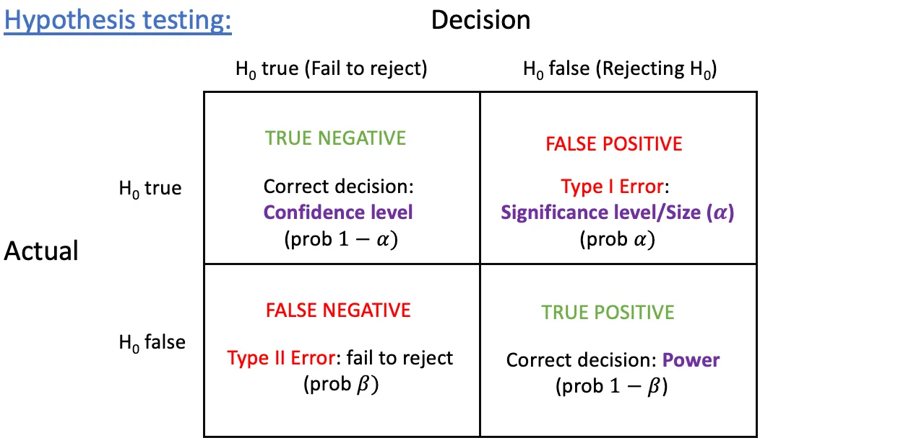
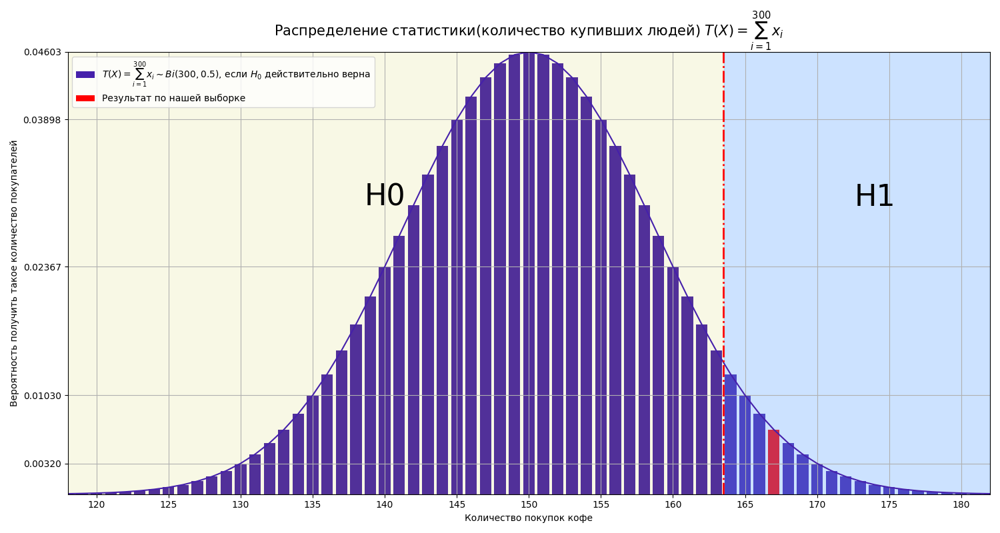
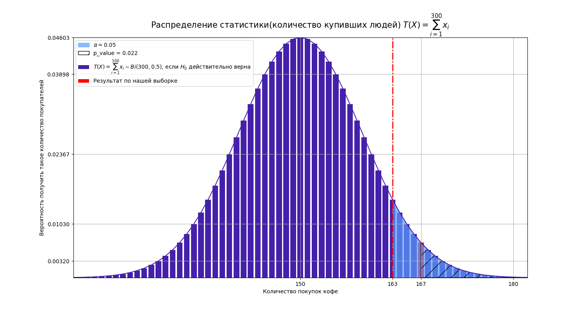

# Фаза 1 • Неделя 1 • Среда

##  Проверка статистических гипотез • Hypothesis testing

---

<!--- backgroundColor: white --->
<!--- paginate: true --->
<!-- header: "" -->

# Сегодня

* посмотрим, как отличить статистически достоверное событие от случайного
* узнаем как устроен пайплайн проверки гипотез
* реализуем функции расчета для некоторых тестов

---
# Проверка статистических гипотез

* Статистическая гипотеза – предположение о свойствах генеральной совокупности. 

* Всю ГС мы исследовать не можем, значит, мы должны собрать  __репрезентативную выборку__, изучить ее, а после проверить гипотезу. 

---

# Задача с кофе

--- 

# Задача с кофе

* в ТЦ стоит один из наших автоматов с кофе. 

* __Ранее__:
  * из тех, кто подходил к нему, с кофе уходил каждый второй.

* __Есть гипотеза__:

  - У нашего автомата сложный интерфейс, и некоторых людей это сбивает с толку и они уходят

* __Изменения__:

  - Разработан новый тестовый интерфейс, и поставлен на наш автомат.

  - В случае успеха, можно будет выкатывать на остальные наши автоматы

* __После__ : 
  * Из 300 людей, которые подошли к нашему автомату, купили 167

---

# Задача

* Подтвердилась ли наша гипотеза? К какому результату интуитивно склоняетесь? 

* Желательно не ошибиться с выбором, так как внедрение нового интерфейса на все наши автоматы стоит денег.

---

# Задача

Формализуем:

* __ГС__ - все люди, которые подошли бы к нашему автомату

* у нас есть __выборка__ $x_1, x_2, x_3, ..., x_{300}
$

* $x_{i} \sim Be(p)$ (_купил/не купил_)

* $p$ - неизвестный для нас параметр ГС - доля тех, кто купил бы, подойдя к автомату

* Пример выборки $[1, 1, ...,  1, 0, 1, 0, 1, 1]$ (_167 купили, 133 не купили_)

---
# Статистическая гипотеза

Нулевая гипотеза $H_0$ – это гипотеза, которой мы придерживаемся, пока наблюдения не заставят признать обратное. Ей всегда сопутствует альтернативная гипотеза $H_1$.

* $H_0$ почти всегда формулируется, как "значимых изменения нет"

* $H_1$ - "значимые изменения есть"

---
# Статистическая гипотеза

В нашем случае:

* $H_0: p=0.5$ (конверсия в покупку такая же и осталась)
* $H_1: p > 0.5$ (конверсия увеличилась)

По результатам исследования мы остановимся на одной из гипотез

---
# Ошибка первого и второго рода

* Ошибка первого рода($FP$) - это ситуация, когда $H_0$ отвергается, хотя она, на самом деле, верна
  * $\alpha$ – вероятность ошибки первого рода или уровень значимости
* Ошибка второго рода($FN$) - это ситуация, когда $H_0$ принимается, хотя она неверна
  * $\beta$ – вероятность ошибки второго рода

Некоторая сложность: при уменьшении ошибки первого рода, увеличивается ошибка второго рода и наоборот. 

---
# Ошибка первого и второго рода

* Матрица ошибок (confusion matrix)

---
# Примеры

* Например, суд выдвигает гипотезу $H_0$: подсудимый невиновен. А он, на самом деле, виновен, но суд признает его невиновным за отсутствием улик 
(презумпция невиновности). То есть суд принимает гипотезу, хотя она неверна.
* "Ложноположительный результат" при при медицинских анализах – это ошибка какого рода?

---
# Статистика критерия

__Статистика__ – любая функция, получаемая по выборке. В каком-то смысле это просто посчитанная метрика

Обозначение: $\mathrm{T}(\vec{x})$,  где $\vec{x}= (x_1,x_2,x_3, ..., x_n)$ - выборка

* Статистика агрегирует информацию о выборке.

* Самые частые статистики:

  - Среднее, доля, медиана, количество, квантиль и т.д

* Кастомные статистики

  - Показатель удовлетворенности клиентов (Customer Satisfaction Score, CSS)
  - Показатель устойчивости бизнеса(Customer Loyalty Index, CLI)
  - "Здесь бы могла быть ваша статистика🙂"

<!-- 1. Для каждой задачи выбирается __уровень значимости__($\alpha$) и __статистика__. 
2. Вычисляется значение статистики.
3. По значению статистики делается вывод о справедливости гипотезы. 
4. При справедливости нулевой гипотезы будет известно, с какой вероятностью и какое значение принимает статистика критерия, ведь мы будем знать, как именно выглядит распределение статистики.  -->

---
# Наша задача

* Возьмем в нашем примере с кофе $T(X) = \sum_{i=1}^{300}x_i$, иначе говоря, сколько людей купили у нас кофе. 

* Важно понимать, что __$T(X)$__ тоже является __случайной величиной__, а значит имеет свое распределение, это __ключевой момент__ в данной теме.

* Именно знание распределения статистики дает нам понимания, насколько __экстремальное__ значение мы вообще получили.

* Например при проверки монетки на честность получить 90 орлов после 100 подбрасываний кажется слишком экстремальным, и скорее она не честная. 

---

# Наша задача

 

---
# Проверка гипотез: алгоритм

1. Сформулировать основную и альтернативную гипотезы, задать уровень значимости $\alpha$ 
2. Найти критические значения статистики для соответствующего уровня значимости
3. Вычислить значение статистики и определить, попало ли оно в критическую область
4. Сделать вывод: если значение попало в критическую область - отвергнуть нулевую гипотезу, в противном случае принять

---
# Наша задача

* $\alpha$ = 0.05 - уровень значимости или ошибка первого рода

 

---
# Критическая область

__Критической__ областью называется область значений статистики критерия, при которых отвергается $H_0$. А критические значения - это граница критической области.

---

# p-value 

* __P-value__ можно интерпретировать как вероятность ошибиться, если мы выбираем гипотзу H1.

 

---

# Итоги

* Статистические тесты позволяют ответить есть ли __статистически значимый результат__

* Ошибки 1-го рода($\alpha$) и 2-го рода($\beta$) не хороши для нас, однако в большинстве случаев их не избежать. Катастрофичность каждой из них зависит от конкретной задачи

* __p-value__ позволяет оценить вероятность ошибки и принять решение

<!-- 
# Мощность критерия

* **Мощностью** критерия называется вероятность не совершить ошибку второго рода, то есть $1−\beta$. А наиболее мощным критерием из всех критериев с уровнем значимости $\alpha$ называется тот, который обладает наибольшей мощностью.

* Зафиксировав уровень значимости, можно уменьшить ошибку второго
рода, то есть увеличить мощность, за счёт выбора критической
области. При определённых условиях можно получить наиболее
мощный критерий!

# Мощность критерия

источник: [Ошибки, встроенные в систему: их роль в статистике](https://habr.com/ru/post/444992/) -->

