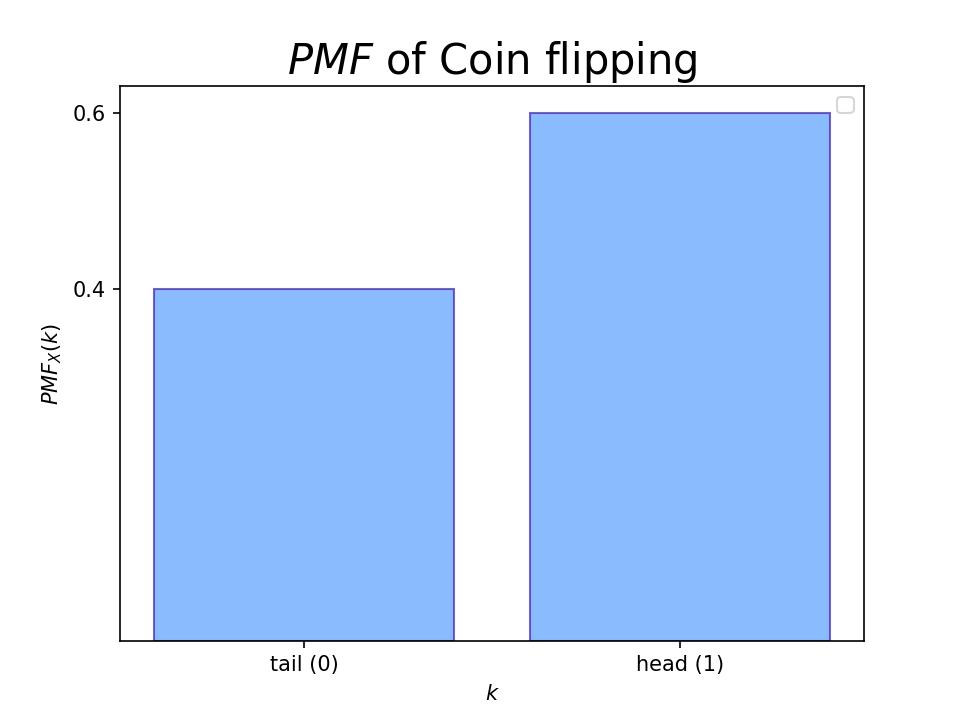
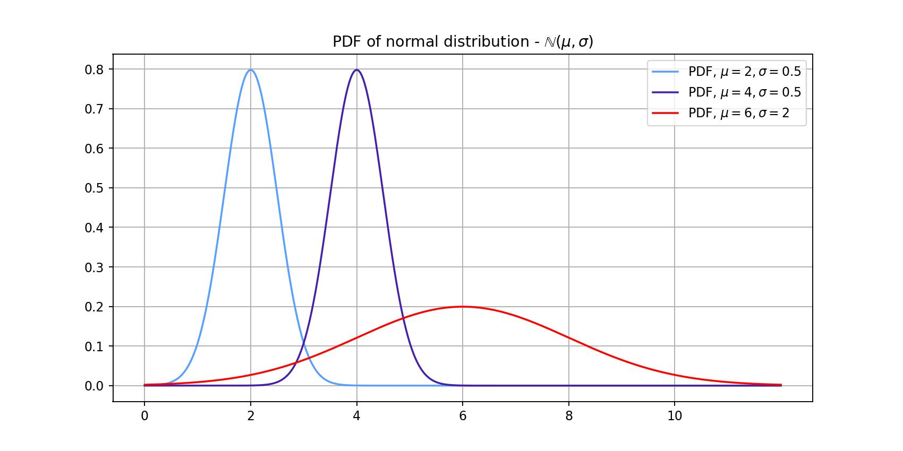
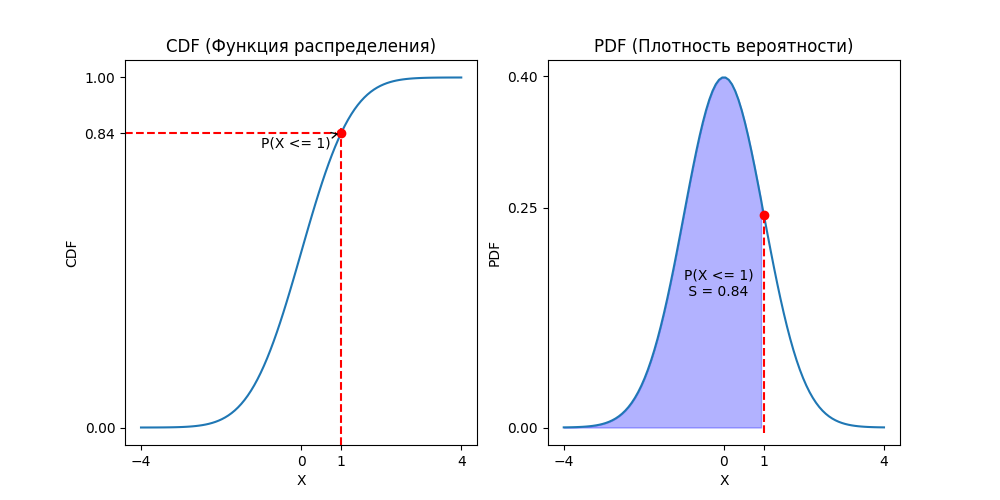
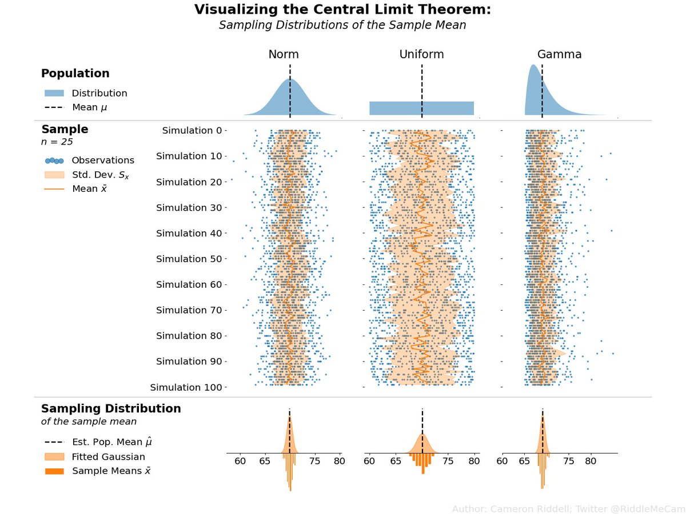
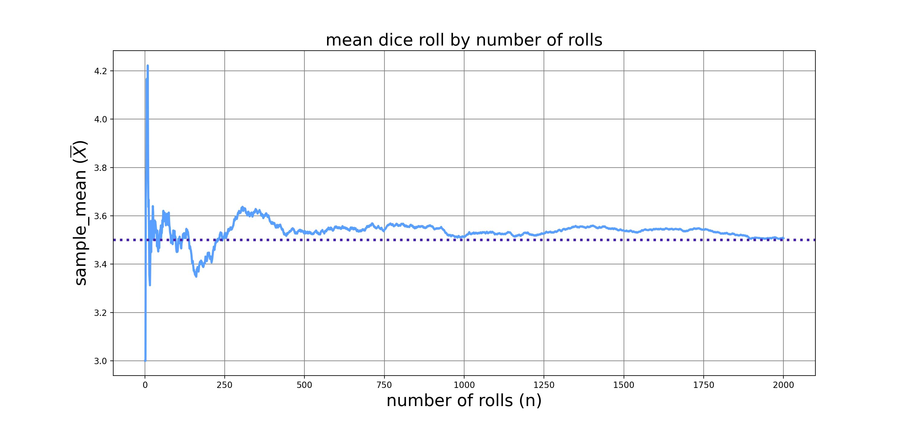
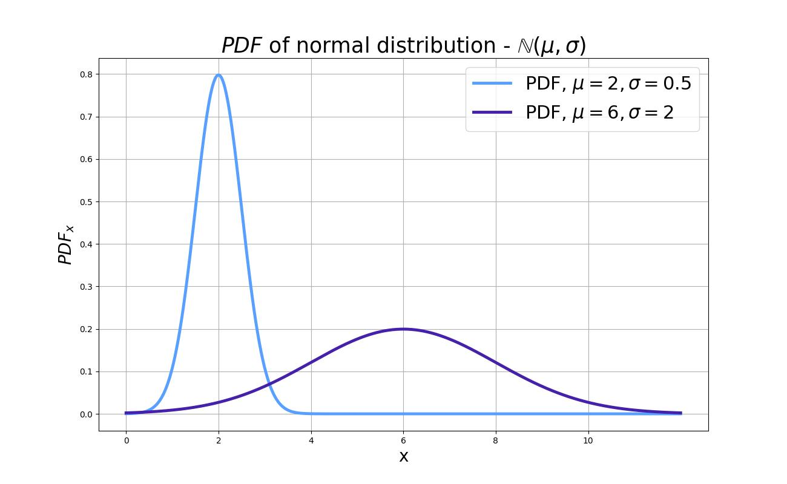
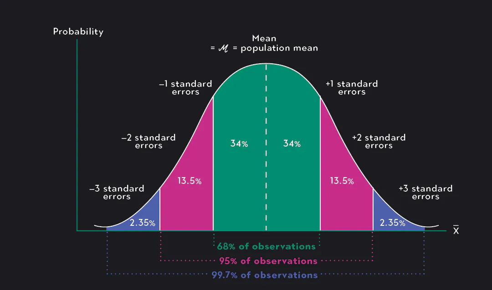
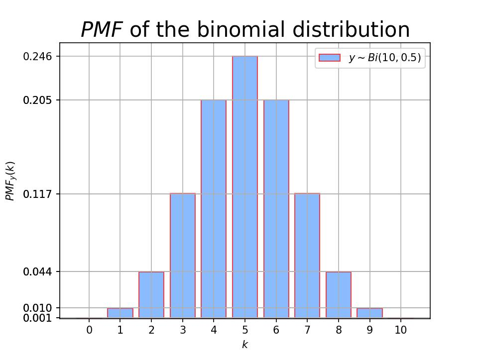
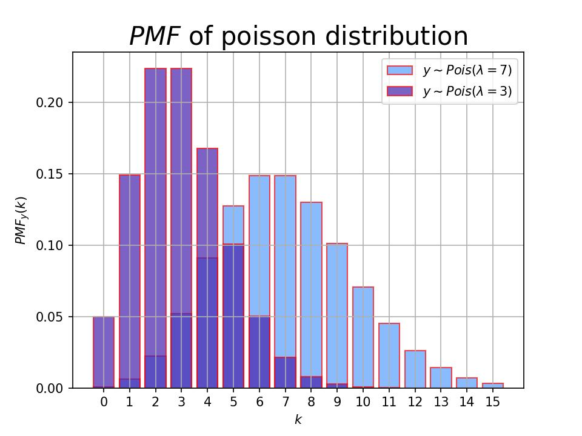
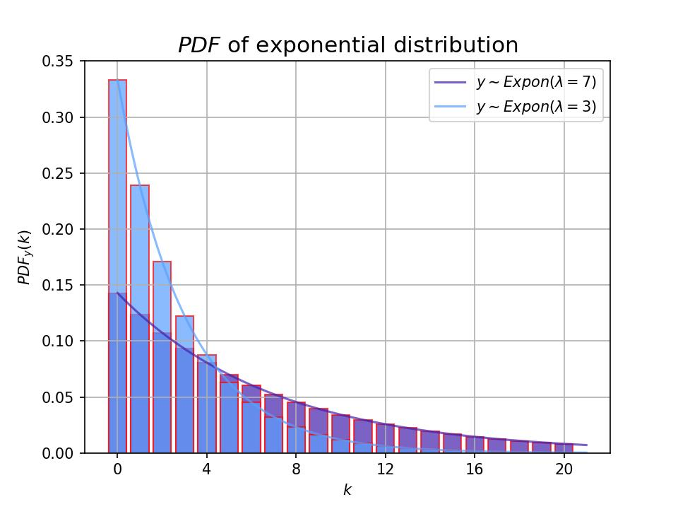

# Фаза 1 • Неделя 1 • Вторник

##  • Основные распределения в теории вероятностей 

##  • Введение в статистику 

---

<!--- backgroundColor: white --->
<!--- paginate: true --->
<!-- header: "" -->

# Сегодня

* сопоставление теории вероятностей и статистики
* основные распределения
* предмет изучения
* области применения

---
# Сопоставление ТВ и статистики

* **Генеральная совокупность(ГС)** - все объекты, которые имеют качества, свойства, интересующие исследователя
* **Выборка** - часть генеральной совокупности элементов, которая охватывается экспериментом

Это два ключевых определения, так как теория вероятностей описывает первое, а статистика занимается вторым!

Получить в распоряжение все данные о ГС маловероятно, на практике есть лишь выборки. С помощью выдвигаемых нами гипотез(об этом завтра) мы будем пытаться оценить всю нашу ГС!

Но чтобы правильно оценить, нам нужно знать терминологию описания ГС, поэтому речь сегодня пойдет о распределениях и их характеристиках.

---
# Сопоставление ТВ и статистики
 

---

# Распределение данных

* __Распределением случайной величины__ или __Распределением данных__ в статистике называют сопоставление значений исследуемых данных с частотой возникновения этих значений, либо с вероятностью возникновения этих значений 

* В Питоне гистограмма(__histplot__), или барплот(__barplot__) позволяет взглянуть на _распределение_ данных. Либо в частотном, либо в вероятностном виде.

---
# Распределение данных

* дискретные
* непрерывные

---

# Типы данных

* дискретные: отдельные значения, которые можно подсчитать
  - тип автомобиля: легковой, грузовой и пр. 
  - словесное обозначение цвета: желтый, красный и пр.
  - количество людей в очереди на кассе супермаркета
* непрерывные: принимают любые значения в каком-либо интервале
  * рост
  * расстояние
  * возраст
  * пр. 

--- 

# Функция вероятности (pmf)

Функция, возвращающая вероятность того, что дискретная случайная величина $X$ примет определённое значение $k$. Является инструментом анализа **дискретных** величин. Обозначение: $P_X(k) = P(X = k) = PMF_X(k)$, где $k$-дискретно.

 
  

    

       
      
    

    

    
$$X \sim Be (p)$$

$
X \sim
\begin{pmatrix}
\bm{tails(0)} & \bm{heads(1)}  \\ 
 1- p & p  \\ 
\end{pmatrix}
$

В нашем случае $p = 0.6$
    

  

 

> 🔥`scipy.stats.bernoulli(p=0.6).pmf()` (probability mass function)

---

<!-- _footer: 📝[wiki Плотность вероятности](https://ru.wikipedia.org/wiki/%D0%9F%D0%BB%D0%BE%D1%82%D0%BD%D0%BE%D1%81%D1%82%D1%8C_%D0%B2%D0%B5%D1%80%D0%BE%D1%8F%D1%82%D0%BD%D0%BE%D1%81%D1%82%D0%B8) -->
# Функция плотности вероятности (pdf)

Функция, характеризующая сравнительную вероятность реализации тех или иных значений случайной переменной (переменных). Является инструментом анализа **непрерывных** величин. Обозначение: $f_\xi(x) = P(\xi = x)$, x - непрерывен.

> 🔥`scipy.stats.norm(loc=2, scale=0.5).pdf()` (probability density function)

--- 

# Функция распределения(cdf)

Функция, характеризующая распределение случайной величины или случайного вектора; вероятность того, что случайная величина $X$ примет значение, меньшее либо равное $х$, где $х$ — произвольное действительное число. Обозначение: $F_\xi(x) = P(\xi \leq x).$ Общий для **дискретных** и **нерперывных**.

---
# Функция распределения(cdf)

* Графическая связь с __cdf__ и __pdf__

> 🔥`scipy.stats.norm(loc=0, scale=1).cdf(1)` (cumulative distribution function)

---
# Квантиль распределения(ppf)

* значение, которое заданная случайная величина не превышает с фиксированной вероятностью. Если вероятность задана в процентах, то квантиль называется _процентилем_ или _перцентилем_

* Квантиль уровня $\gamma$:

  Если $F(x_\gamma) = \gamma$, то значение $x_\gamma = F^{-1}(\gamma)$ - является кватилем уровня $\gamma$

* Квантиль является обратной функцией, к функции распределения

> 🔥`scipy.stats.norm(loc=0, scale=1).ppf(0.84)` (percent point function)

---

# Основные характеристики распределений

_Для ГС_:

**Математическое ожидание**(среднее): $\mathbb{E}[X], \mathbb{M}[X]$ 

* Сколько в среднем принимает случайная величина
* Для дискретной случайной величины $\mathbb{E}[X] = \sum_{i}^{n}x_i  p_i$
* Для непрерывной случайной величины $\mathbb{E}[X] = \int_{-\infty}^{+\infty}x_i f(x_i)$

_Для выборки_:

Выборочное среднее является наилучшей оценкой мат.ожидания ГС, иначе говоря лучше всего приближает это значение (**np.mean()**)

**Выборочное среднее**: $\bar{X} = \dfrac{1}{n}\sum_{i=1}^{n}x_i$

> 🔥`np.mean()`

---

# Основные характеристики распределений

_Для ГС_:

**Дисперсия**: $\mathbb{D}[X] = \mathbb{E}[(X - \mathbb{E}[X])^2] = \mathbb{E}[X^2] - (\mathbb{E}[X])^2$

* Мера _разброса_ случайной величины
* Часто обозначается как $\mathbb{D}[X]$, $Var [X]$ (variance)

_Для выборки_:

Выборочная дисперсия является наилучшей дисперсии ГС, иначе говоря лучше всего приближает это значение (**np.var()**)
**Выборочная дисперсия**: $\mathbb{s}^2 = \dfrac{1}{n-1}\sum_{i=1}^{n}(x_i - \bar{X})^2$

> 🔥`np.var(ddof=1)` (при ddof=1 в знаменателе формулы n-1)

---

# Основные характеристики распределений

**Стандартное отклонение**: $\sigma_x = \sqrt{\mathbb{D}[X]}$

* тоже мера разброса, но измеряется в тех же величинах, что и исходная случайная величина
* вычисляетя просто как корень из дисперсии

_Для выборки_:
* аналогично извлечеть корень из выборочной дисперсии

> 🔥`np.std(ddof=1)` (при ddof=1 в знаменателе формулы n-1)

---

# Центральная предельная теорема(!!!)

> Для данной генеральной совокупности, описанной любым распределением вероятностей, имеющим среднее $\mu$ и конечную дисперсию $\sigma^2$, распределение выборочного среднего $\bar{X}$, вычисленное по выборке размера $n$ из этой совокупности будет приблизительно нормальным со средним $\mu$ (среднее значение совокупности) и дисперсией $\dfrac{\sigma^2}{n}$ (дисперсия совокупности деленная на $n$), при большом размере выборки $n$.

---
# Центральная предельная теорема(!!!)

* Лежтит в основе статистической проверки гипотез, об этом завтра 

---

# Закон больших чисел 

Идея простая: при увеличении числа испытаний выборочное среднее случайной величины стремится к истинному математическому ожиданию распределения. 

---

# Примеры распределений

* Ниже приведены основные типы распределений

---

# Нормальное распределение
 

Если величина является суммой многих случайных слабо взаимозависимых величин, каждая из которых вносит малый вклад относительно общей суммы, то центрированное и нормированное распределение такой величины при достаточно большом числе слагаемых стремится к _нормальному_ распределению. 

 
  

    

       
      
    

    

    
$x \sim \mathbb{N}(\mu, \sigma)$

$\mathbb{E_x} = \mu$

$\mathbb{\sigma_x} = \sigma$

  

 

---

# Правило трех сигм

* данное правило сформулировано именно для нормального распределения. Однако эти процентили можно узнать и для любого другого распределения

---

# Распределение Бернулли

Дискретное распределение вероятностей, моделирующее случайный эксперимент произвольной природы, при заранее известной вероятности успеха ($p$) или неудачи ($q = 1 - p$). (_Приведите пример из жизни такого распределения_)

 
  

    

       
      
    

    

$x$ - Что выпало на монете
    
$x \sim Be (p)$

$\mathbb{E_x} = p$

$\mathbb{\sigma_x} = \sqrt{p\left(1-p\right)}$

$PMF_x(x = k ) = p^k \cdot (1-p)^{1-k}$

  

 

> 🔥`scipy.stats.bernoulli(p=0.6).pmf()` (probability mass function)

---

# Биномиальное распределение 

Распределение количества "успехов" в последовательности из $n$ независимых случайных экспериментов, таких, что вероятность "успеха" в каждом из них постоянна и равна $p$.  (_Приведите пример из жизни такого распределения_)

 
  

    

       
      
    

    

    
$x_i \sim Be (p)$
$y = x_1 + x_2 + ... + x_n$
$y \sim Bi(n, p)$
$\binom{n}{k} = \dfrac{n!}{(n-k)!k!}$ – биномиальный коэффициент

$pmf_y (k) = \mathbb{P}(y = k) = \binom{n}{k} p^k (1-p)^{n-k}$

$\mathbb{E_x} = n * p$
$\mathbb{\sigma_x} = \sqrt{n* p * \left(1-p\right)}$

  

 

> 🔥`scipy.stats.binom`

---

# Распределение Пуассона

Дискретное распределение случайной величины, представляющей собой __число событий, произошедших за фиксированное время__, при условии, что данные события происходят с некоторой фиксированной средней интенсивностью и независимо друг от друга. Является приближением биномиального распределения, в случае, когда $n$ - очень большое, а $p$ - очень маленькое. $n \cdot p = \lambda$. 

---

# Распределение Пуассона

  

    

       
      
    

    

    
$y \sim Pois (\lambda)$

$pmf_y (k) = \mathbb{P}(y = k) = \dfrac{\lambda^k}{{k!}}\mathbb{e}^{-\lambda}$

$\mathbb{E_x} = \lambda$
$\mathbb{\sigma_x} = \sqrt{\lambda}$

  

 

* Количество опоздавших автобусов за день
* Число посетителей на веб-сайте за сутки

 

> 🔥`scipy.stats.poisson(lambda)`

---

<!-- _footer: 📝[Advanced Math and Statistics Robert Kissell, Jim Poserina, in Optimal Sports Math, Statistics, and Fantasy, 2017](https://www.sciencedirect.com/topics/mathematics/exponential-distribution) -->

# Экспоненциальное распределение

  

    

       
      
    

    

    
$y \sim exp (\lambda)$

$pdf_y (k) = \mathbb{P}(y = k) = \lambda \cdot \mathbb{e}^{-\lambda x}$

$\mathbb{E_x} = \dfrac{1}{\lambda}$
$\mathbb{\sigma_x} = \dfrac{1}{\lambda}$

  

 

* Время между отказами оборудования
* Время потраченное на звонок с клиентом

 

> 🔥`scipy.stats.expon(lambda)`

---

# Итоги

* Случайные величины появляются повсеместно: свойства объектов, измерения и пр
* Часто они бывают близки к каким-то распределениям
* Распределение – математическая модель
* У распределений есть характеристики – об этом надо помнить
* Всех распределений не выучить: [Univariate Distribution Relationships](http://www.math.wm.edu/~leemis/chart/UDR/UDR.html)

---

<!-- _footer: $*$ Функция выживания = 1 - Функция распределения -->

# Справка по функциям

| **`scipy func`** | **Название**                   | **Вопрос**                                                               | **Пример**                                                                        |
| :--------------: | ------------------------------ | ------------------------------------------------------------------------ | --------------------------------------------------------------------------------- |
|      `pmf`       | Функция вероятности            | Какова вероятность, что $X$ примет значение $x$?                 | Какова вероятность выпадения числа 3 при броске кубика?                           |
|      `pdf`       | Функция плотности вероятности  | Какова плотность вероятности случайной величины $X$ в точке $x$? | Какова плотность нормального распределения в точке $x = 1$?                   |
|      `cdf`       | Функция распределения          | Какова вероятность, что $X\leq x$?                                  | Какова вероятность того, что время до отказа устройства составит не больше 2 лет? |
|       `sf`*       | Функция выживания              | Какова вероятность, что $X > x$?                                     | Какова вероятность того, что время до отказа устройства будет больше 2 лет?       |
|      `ppf`       | Обратная функция распределения | Какое значение $X$ соответствует вероятности $p$?                | Какое значение распределения соответствует 95%-му процентилю?                     |

