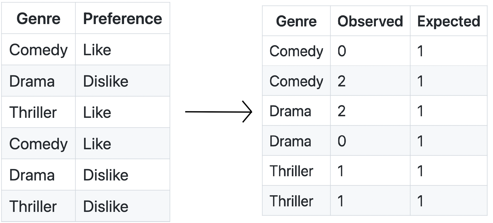
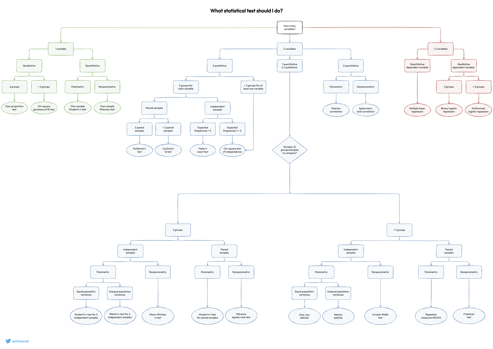

# Фаза 1 • Неделя 1 • Среда

##  Проверка статистических гипотез • Hypothesis testing

---

<!--- backgroundColor: white --->
<!--- paginate: true --->
<!-- header: "" -->

# Проверка гипотезы о среднем

$$H_0: \mu = \mu_0 $$
$$H_1: \mu \neq \mu_0 $$

> Среднее генеральной совокупности $\mu$ равно некоторому предполагаемому среднему $\mu_0$

---
# Проверка гипотезы о среднем

В случае __известного стандартного отклонения__ для всей ГС, статистика критерия 
$$z = \dfrac{\bar{x} - \mu_0}{\sigma / \sqrt{n}} \sim \mathbb{N}(0, 1)$$ 
имеет нормальное распределение в предположении справедливости гипотезы $H_0$.

Зная вид распределения у статистики $z$, мы можем оценить, насколько вероятно было получить посчитанное нами значение и на основе этого делать выводы! 

* Для левосторонней области необходимо найти квантиль уровня $\alpha$
* Для правосторонней уровня $1-\alpha$
* Для двусторонней – квантили уровней $\frac{a}{2}$ и $1-\frac{a}{2}$

> Если стандартное отклонение известно, то используется $z$-критерий.

--- 
# Проверка гипотезы о среднем: пример

Студенты университета в начале учебного года сдают предварительное тестирование, оцениваемое по десятибалльной шкале. Вы предполагаете, что средняя оценка равна $6$, и решаете это проверить, опросив несколько человек. Получилась следующая выборка: $9, 5, 7, 7, 4, 10$. Из наблюдений прошлых лет известно, что дисперсия $\sigma^2 = 1$. Проверим гипотезу, что среднее равно $6$, на  уровне значимости $\alpha = 0.01$ против односторонней альтернативы $\mu > 6$.

--- 
# Проверка гипотезы о среднем: пример 
1. $H_0: \mu=6, \; H_1: \mu > 6$
2. Критическая область правосторонняя: $1-\alpha=0.99$, критическое значение $z_{cr} = 2.33$. Чтобы отвергнуть $H_0$, нам нужно, чтобы оно было больше $2.33$. 
3. $\bar{x} = 7, \; \sigma=1, \; n=6$. Тогда $z = \dfrac{7-6}{1 / \sqrt{6}} \approx 2.45$ [[калькулятор]](https://planetcalc.ru/4986/)
4. Т.к. $z > z_{cr}$, нулевая гипотеза отвергается в пользу альтернативной.
---

# Проверка гипотезы о среднем 
Если стандартное отклонение гипотезы неизвестно или же имеем небольшую выборку, то используется $t$-статистика (aka тест Стьюдента, $t$-тест). 
Процедура остается прежней, но статистика меняется: 
$$t = \dfrac{\bar{x}-\mu_0}{s / \sqrt{n}}$$
Тогда $t \sim St(n-1)$ - Распределение Стьюдента

$s$ - выборочная оценка стандартного отклонения: 
$$s = \sqrt{\frac{1}{n-1}\sum_{i=i}^{n}(x_i - \bar{x})^2}$$

---

# Проверка гипотезы о среднем: пример

Для сравнения двух выборок между собой, $t$-тест применим тоже.

$H_0$: $\mu1 = \mu2$

$H_1$: $\mu1 \neq \mu2$

$$t = \dfrac{\mu_1-\mu_2}{\sqrt{\dfrac{s^2_1}{n_1} + \dfrac{s^2_2}{n_2}}}$$

Тогда $t \sim St(n_1+n_2-2)$ - Распределение Стьюдента

$\mu_i, s^2_i, n_i$ - параметры $i$-ой выборки

---
# Проверка гипотезы о среднем: пример
* Дана выборка: $1, 0, 3, 5, 4$, уровень значимости $\alpha = 0.01$, гипотезы: 
$$H_0: \mu=3, \; H_1 : \mu < 3$$

* Критическая область левосторонняя, число степеней свободы 
$df = n - 1 = 4$, по квантилю уровня $\alpha$ определяем критическое значение $t_{cr} = -3.74$

* Вычисляем значение статистики: $t_{st} = 0.64$

* Вывод: $t_{st} \notin (-\infty; -3.74)$ => $H_0$ не отвергается. 

---
# Гипотезы о виде распределения

* __U-критерий Манна — Уитни__, который сравнивает два распределения. Данный тест в отличие от многих других является __непараметрическим__

* $H_0:$ две группы имеют одинаковое распределение

* $H_1:$ одна из групп имеет большие (или меньшие) значения, чем другая

$U_{1} = R_{1} - n_{1} (n_1 + 1) / 2$, где R₁ — сумма рангов точек данных в первой группе, а n₁ — количество точек в первой группе.

$U_{2} = R_{2} - n_{2} (n_2 + 1) / 2$

$T_{stat} = min ({U_1, U_2}) \sim N(\dfrac{n_1 * n_2}{2}, \dfrac{n_1 * n_2 * (n_1 + n_2 + 1)}{12})$ 

---

# Зависимость категориальный признаков(Хи-квадрат)

* Предположим у вас есть датафрейм, вам необходимо оценить влияние категориальных признаков. 

---
# Зависимость категориальный признаков(Хи-квадрат)

$H_0$: Признак _Genre_ не влияет на _Preference_
$H_1$: Признак _Genre_ влияет на _Preference_

$$T(X) = \sum_{i=1}^n \dfrac{(O_i - E_i) ^ 2}{E_i} \sim \chi^2(n-1)$$

* $O_i$ - фактически наблюдаемые значения(Observed)
* $E_i$ - ожидаемые значения в рамках истиности гипотезы $H_0$

---
# Гипотеза о доле

* Проверяем гипотезу $H_0 : p = p_0$
* Значение статистики вычисляется как
$$z = \dfrac{\hat{p} - p_0}{\sqrt{\dfrac{p_0 (1-p_0)}{n}}} \sim N(0, 1)$$
$n$ - объем выборки, $p_0$ предполагаемая доля носителей признака, $\hat{p}$ - выборочная доля носителей признака. 

>Проверим гипотезу, что доля признака в ГС равна $0.1$ на уровне значимости $\alpha = 0.05$, против односторонних альтернатив $p > 0.1$.
Объем выборки $n = 100$ и пусть выборочная доля составила $\hat{p} = 0.2$

---
# Гипотеза о дисперсии

* Проверяется гипотеза $H_0 : \sigma^2 = \sigma^{2}_{0}$
* Статистика 
$$ \chi^2 = \dfrac{(n-1)s^2}{\sigma^{2}_{0}} $$
* Для правосторонней области ищется по значению $1-\alpha$ квантиль $\chi^{2}_{r}$, для левосторонней ищется по значению $\alpha$ $\chi^{2}_{l}$, для двусторонней находят оба квантиля.

>Компания продает горные лыжи и сноуборды. Имеются данные по ежедневным продажам. Мы можем сравнить дисперсию двух групп. 

>Например, если дисперсия продаж сноубордов значительно больше, чем дисперсия продаж лыж, это может указывать на более переменный спрос или какие-то внешние колебания продаж сноубордов.

---
# Карта статистических тестов

<!-- _footer: 📝[Карта статистических тестов](https://statsandr.com/blog/what-statistical-test-should-i-do/)  -->

---
# Доверительные интервалы 

* Часто точечной оценки какой-либо метрики недостаточно. 
* Можно спросить у двух людей их рост, вычислить среднее и получить какую-то величину, которая будет крайне мало связана с величиной, вычисленной по генеральной совокупности. 
* Для этого можно построить доверительный интервал: интервал, который с заданной вероятностью накрывает истинное значение. 

---
# Доверительные интервалы

Если дисперсия известна (чего почти никогда не бывает): 
* Доверительный интервал для среднего имеет вид: $(\bar{x} - \Delta; \bar{x}+ \Delta)$, $\Delta$ – точность интервальной оценки. 
* Если известна $\sigma$, то $\Delta = \dfrac{\sigma}{\sqrt{n}}z_{1 - \frac{\alpha}{2}}$

> Если известна дисперсия, то доверительный интервал для среднего имеет вид: 
$$(\bar{x} - \dfrac{\sigma}{\sqrt{n}}z_{1 - \frac{\alpha}{2}}); (\bar{x} + \dfrac{\sigma}{\sqrt{n}}z_{1 - \frac{\alpha}{2}})$$

---

# Доверительные интервалы: задача

$$(\bar{x} - \dfrac{\sigma}{\sqrt{n}}z_{1 - \frac{\alpha}{2}}); (\bar{x} + \dfrac{\sigma}{\sqrt{n}}z_{1 - \frac{\alpha}{2}})$$

Дана выборка $9, 5, 7, 7, 4, 10$, дисперсия $\sigma = 1$. Постройте 99% доверительный интервал.

---
# Доверительные интервалы

* Если __стандартное отклонение неизвестно__, а __объем выборки больше 30__, то процедура остается прежней, но данное по условию задачи ст.откл. заменяется на выборочное стандартное отклонение. 

* В самом общем случае, вместо квантиля стандратного нормального распределения нужно использовать квантиль распределения Стьюдента ($t$ - распределения): 
$$(\bar{x} - \dfrac{s}{\sqrt{n}}t_{1 - \frac{\alpha}{2}}(n-1)); (\bar{x} + \dfrac{s}{\sqrt{n}}t_{1 - \frac{\alpha}{2}}(n-1))$$

---

# Bootstrap

* Позволяет эмпирически получить доверительный интервал для измеряемой метрики

---

# Итоги

* статистика применяется везде, где может применяться
* распределения - важная часть работы с данными
* визуализация очень важна
* проверка статистических гипотез - очень тонкая процедура
* подробнее про все: [Доверительные интервалы](https://mse.msu.ru/wp-content/uploads/2020/03/%D0%9B%D0%B5%D0%BA%D1%86%D0%B8%D1%8F-5-%D0%B4%D0%BE%D0%B2%D0%B5%D1%80%D0%B8%D1%82%D0%B5%D0%BB%D1%8C%D0%BD%D1%8B%D0%B5-%D0%B8%D0%BD%D1%82%D0%B5%D1%80%D0%B2%D0%B0%D0%BB%D1%8B.pdf)